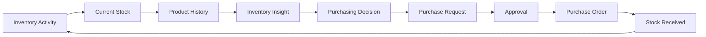

# 🚀 SwiftBuy

**Know your stock. Understand your inventory. Make better purchasing decisions.**

SwiftBuy is a lightweight **inventory and procurement management platform** built for small and medium-sized businesses (SMEs).

It helps businesses track inventory, understand product movement, identify purchasing needs, control purchase decisions, and keep a reliable history of stock activity.

---

## 🎯 Vision Statement

We envision a future where every business owner has complete confidence in the accuracy and availability of their inventory at any point in time.

---

## 🎯 Product Purpose

Many SMEs still manage inventory using spreadsheets, notebooks, or other manual processes.

This often leads to:

- Inaccurate stock counts
- Duplicate data entry
- Poor accountability
- Delayed procurement
- Stock shortages
- Excess stock
- Poor visibility into product history

SwiftBuy provides a centralized system for managing inventory and procurement workflows.

---

## 🔄 Core Business Loop



> **Flow: Track → Understand → Decide → Purchase → Receive → Update.**

## ✨ MVP Features

### 📦 Product Management

- Create and manage products

- Organize products by category

- Define product units

- Assign SKUs

- Activate or deactivate products

---

### 👥 MVP Users

| Role              | Responsibility                                      |
| ----------------- | --------------------------------------------------- |
| Owner / Admin     | Business oversight, reports, approvals              |
| Inventory Manager | Inventory monitoring and purchasing decisions       |
| Storekeeper       | Stock counting, receiving, and inventory operations |
| Supplier          | Supplier information and purchase fulfillment       |

> **Note: Inventory Officer and Manager responsibilities are combined in V1 to keep the role structure lean.**

## 🏗️ Tech Stack

### Backend

- Framework: **NestJS**
- Language: **TypeScript**
- Database: **MySQL**
- ORM: **TypeORM**

### Security & Auth

- JWT Authentication
- Role-Based Access Control _(Planned)_

### Infrastructure

- Docker _(Planned)_
- CI/CD _(Planned)_

---

## 📦 Project Setup

```bash
npm install
```

## 🚀 Running the Application

Development

```bash
npm run start:dev
```

## Production

```bash
npm run build
npm run start:prod
```

## 📋 MVP Scope

| Included                     | Excluded                         |
| ---------------------------- | -------------------------------- |
| Authentication & RBAC        | Payments                         |
| Products & Categories        | POS                              |
| Inventory & Movement History | Customer management              |
| Stock Counting & Adjustments | Multi-store / Multi-warehouse    |
| Suppliers                    | Barcode scanning                 |
| Purchase Requests & Approval | AI forecasting                   |
| Purchase Orders & Receiving  | Full Accounting                  |
| Dashboard & Reports          |
| Offline synchronization      |
| Audit Logs                   | Supplier portal                  |
|                              | Advanced profitability analytics |

> Focus: Focus on solving core inventory management and procurement control before expanding into a full ERP.

## 🎯 Target Audience

SwiftBuy is designed for:

- Retail Stores

- Pharmacies

- Boutiques

- Supermarkets

- Electronics Shops

- Building Material Stores

- Small and Medium Businesses

### 📊 MVP Success Criteria

- SwiftBuy is successful when a business can:

- Know its current stock at any time.

- Understand how stock changed over time.

- Identify products requiring attention.

- Make purchasing decisions using reliable inventory information.

- Control and audit purchasing decisions.

- Accurately track received stock.

- Trace important actions back to responsible users.

🌟 North Star Outcome

> **SwiftBuy becomes a trusted source of inventory and purchasing information.**

### 🔮 Future Direction

The MVP establishes the foundation for future capabilities such as:

- Demand forecasting

- Product health analysis

- Supplier intelligence

- Advanced analytics

- Multi-location inventory

- POS integration

- Accounting integration

- Offline synchronization

- AI-assisted purchasing

These capabilities are intentionally outside the current MVP scope.

## 📈 Long-Term Goal

SwiftBuy aims to evolve from a simple inventory management tool into a complete business operating system that helps SMEs manage inventory, sales, suppliers, customers, and commerce from a single platform.

## 📄 License

MIT License
