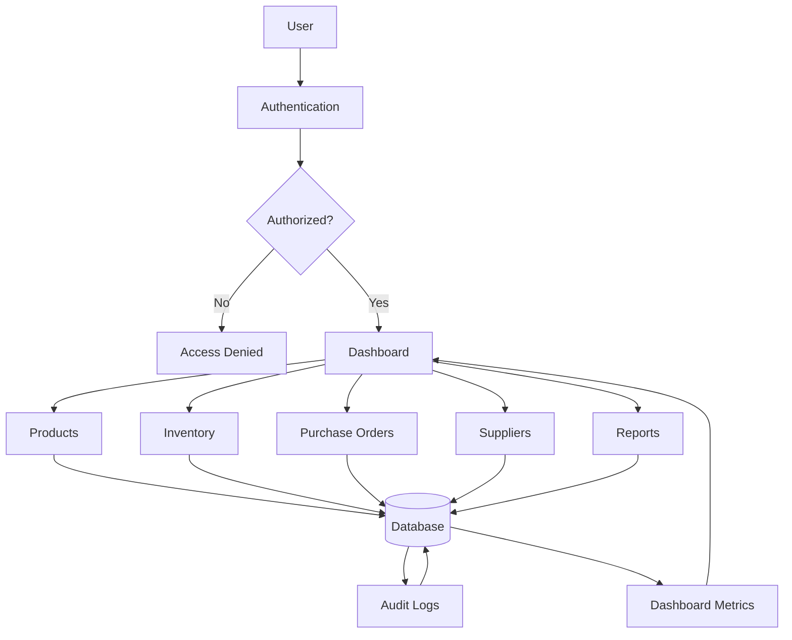

# SwiftBuy System Data Flow

## Overview

This document describes the high-level flow of data within the SwiftBuy MVP.

It shows how users interact with the system, how requests are processed, how different modules communicate, and how information is persisted.

This is a high-level architectural view and should not be confused with individual module workflows.

---

# Objectives

- Describe how data flows through the application.
- Show interactions between users, modules, and the database.
- Provide a reference for developers when implementing new features.

---

# Actors

| Actor       | Description                                     |
| ----------- | ----------------------------------------------- |
| Admin       | Full access to the system                       |
| Manager     | Oversees inventory and purchasing               |
| Storekeeper | Manages inventory operations                    |
| Cashier     | Records sales                                   |
| Supplier    | Receives purchase orders and supplies inventory |

---

# Core Modules

- Authentication(Auth)
- Dashboard
- Users
- Products
- Categories
- Inventory
- Purchase Orders
- Suppliers
- Reports
- Audit Logs

---

# High-Level Data Flow



---

# Data Flow Description

## 1. User Authentication

Every request begins with authentication.

The Authentication module:

- validates credentials
- issues JWT tokens
- loads user roles and permissions

If authentication fails, the request is rejected.

---

## 2. Dashboard

After successful authentication, the user accesses the Dashboard.

The Dashboard retrieves aggregated data from multiple modules, including:

- Inventory
- Purchase Orders
- Reports
- Suppliers

The dashboard does not own data; it consumes data from other modules.

It is read-only.

---

## 3. Product Management

Users can:

- create products
- update products
- archive products
- search products

Product information is stored in the database.

Creating a product does not modify inventory quantities.

---

## 4. Inventory

Inventory tracks stock levels for products.

Operations include:

- stock-in
- stock-out
- stock adjustment
- inventory lookup

Inventory updates trigger audit logs and dashboard metrics.

---

## 5. Purchase Orders

Purchase Orders manage procurement.

Typical flow:

- Draft
- Approval
- Supplier Notification
- Delivery(This responsibility needs be moved to Logistics service)
- Inventory Update(Later send this service to Inventory, by just sending a message)

Purchase Orders interact with:

- Suppliers
- Inventory
- Audit Logs

---

## 6. Suppliers

Suppliers receive purchase orders.

They may:

- accept
- reject
- request changes

Supplier responses update Purchase Order status.

---

## 7. Reports

Reports aggregate information from:

- Inventory
- Products
- Purchase Orders
- Suppliers

Reports are read-only and do not modify business data.

---

## 8. Audit Logging

Every critical action generates an audit record.

Examples:

- Login
- Product created
- Product updated
- Purchase approved
- Stock adjusted

Audit logs improve traceability and accountability.

---

# Database Interaction

All business modules communicate with the central database.

```text
Users
    │
    ▼
Business Module
    │
    ▼
Validation
    │
    ▼
Database
    │
    ▼
Audit Log
    │
    ▼
Dashboard / Reports
```

---

# Cross Module Communication

```text
Authentication
        │
        ▼
Products ──────────────┐
        │              │
        ▼              │
Inventory ◄────────────┤
        │              │
        ▼              │
Purchase Orders ───────┤
        │              │
        ▼              │
Suppliers ─────────────┤
        │              │
        ▼              │
Audit Logs ◄───────────┘
        │
        ▼
Reports
```

---

# Business Rules

- Every request must be authenticated.
- Authorization is enforced using roles and permissions.
- Products exist independently of inventory.
- Inventory changes only through valid stock movements.
- Purchase Orders require approval before reaching suppliers.
- Every critical action creates an audit log.
- Reports are generated from existing business data and never modify records.

---

# Related Documents

- [System Overview](./system_overview.md)
- [System Data Flow](./system_data_flow_diagram.md)
- [Database Design](./database-design.md)
- [Authentication Architecture](./authentication.md)
- [Inventory Module](../modules/inventory/overview.md)
- [Purchase Orders Module](../modules/purchase-orders/overview.md)
- [Suppliers Module](../modules/suppliers/overview.md)
