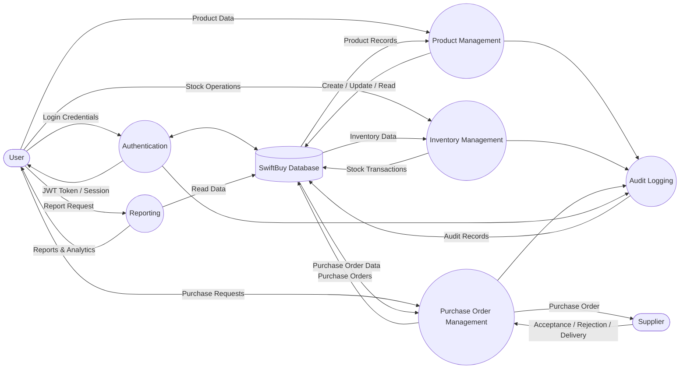

# SwiftBuy Data Flow Diagram (Level 0)

## Overview

This diagram illustrates the high-level flow of data between external entities, the SwiftBuy system, and its persistent data store.

```mermaid
flowchart LR

%% External Entities
User([User])
Supplier([Supplier])

%% Processes
P1((Authentication))
P2((Product Management))
P3((Inventory Management))
P4((Purchase Order Management))
P5((Reporting))
P6((Audit Logging))

%% Data Store
DB[(SwiftBuy Database)]

%% Authentication
User -->|Login Credentials| P1
P1 -->|JWT Token / Session| User
P1 <--> DB

%% Product Management
User -->|Product Data| P2
P2 -->|Create / Update / Read| DB
DB -->|Product Records| P2

%% Inventory
User -->|Stock Operations| P3
P3 -->|Stock Transactions| DB
DB -->|Inventory Data| P3

%% Purchase Orders
User -->|Purchase Requests| P4
P4 -->|Purchase Orders| DB
DB -->|Purchase Order Data| P4

P4 -->|Purchase Order| Supplier
Supplier -->|Acceptance / Rejection / Delivery| P4

%% Reports
User -->|Report Request| P5
P5 -->|Read Data| DB
P5 -->|Reports & Analytics| User

%% Audit
P2 --> P6
P3 --> P6
P4 --> P6
P1 --> P6

P6 -->|Audit Records| DB
```
