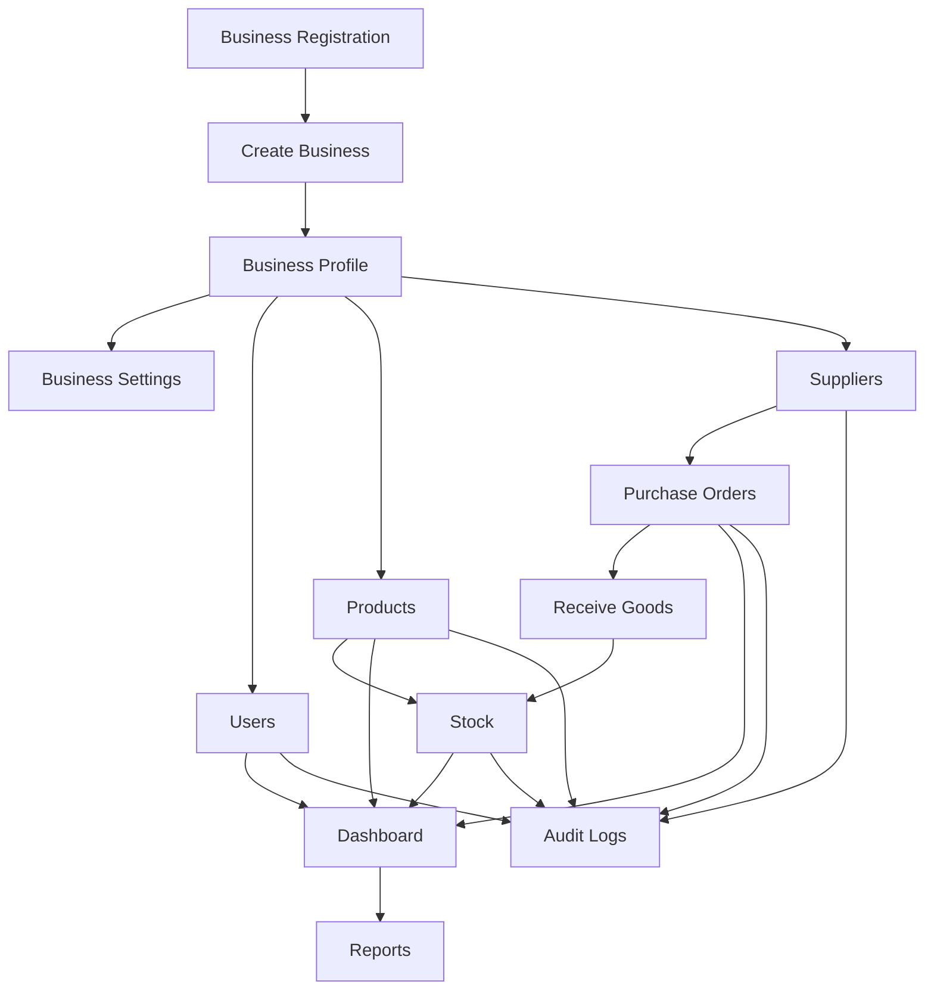
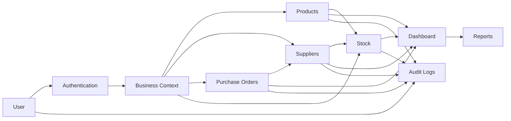
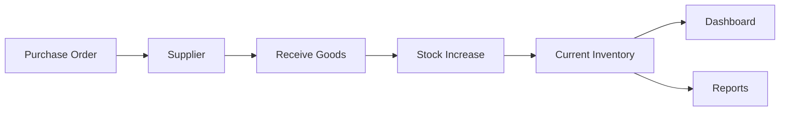
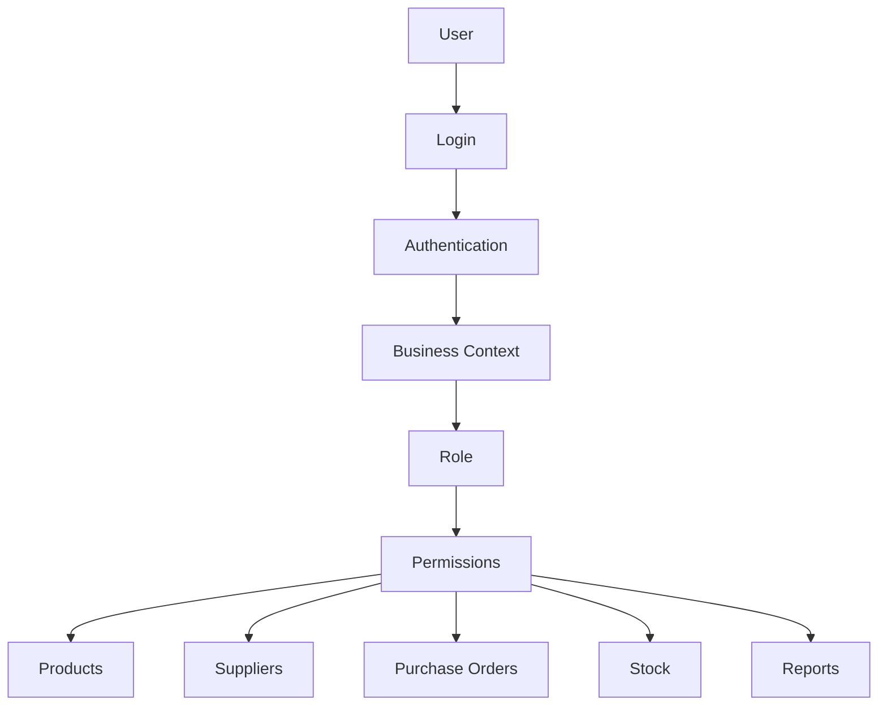

# Business Data Flow

## Overview

The business provides the context through which SwiftBuy's major modules operate.

The high-level flow is:



---

# System-Level Data Flow



---

# Core Business Flow

```text
USER
  ↓
AUTHENTICATION
  ↓
BUSINESS CONTEXT
  ↓
┌─────────────┬──────────────┬──────────────────┬─────────┐
│             │              │                  │
PRODUCTS   SUPPLIERS   PURCHASE ORDERS       STOCK
│             │              │                  │
└─────────────┴──────────────┴──────────────────┘
                       ↓
                  DASHBOARD
                       ↓
                    REPORTS

```

---

# Stock Flow

The stock flow is particularly important to SwiftBuy.



Conceptually:

```text
Supplier
   ↓
Purchase Order
   ↓
Goods Received
   ↓
Stock Increased
   ↓
Current Inventory
   ↓
Dashboard / Reports
```

---

# User Access Flow



The user's:

```text
business_id
```

determines which business's data they operate on.

The user's:

```text
role_id
```

determines what they are allowed to do.
