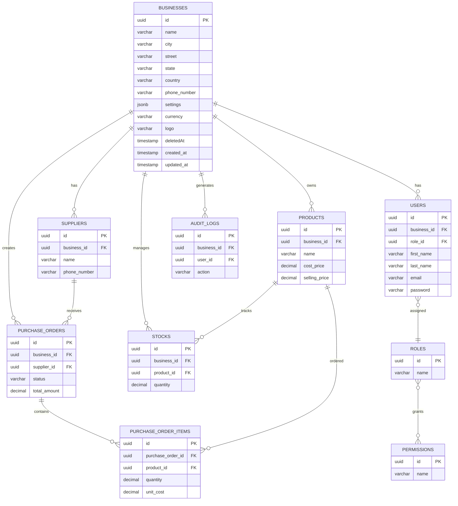

# Business Entity Relationship Diagram

## V1 Business ER Diagram



## Core Relationship

The business is the parent context for business-owned resources.

```text
BUSINESS
   │
   ├── USERS
   ├── PRODUCTS
   ├── SUPPLIERS
   ├── STOCK
   ├── PURCHASE ORDERS
   └── AUDIT LOGS
```

## Important Relationships

### Business → Users

```text
BUSINESS 1 ──── N USERS
```

One business can have multiple users.

### Business → Products

```text
BUSINESS 1 ──── N PRODUCTS
```

A business owns its product catalogue.

### Business → Suppliers

```text
BUSINESS 1 ──── N SUPPLIERS
```

Suppliers belong to a business.

### Business → Stock

```text
BUSINESS 1 ──── N STOCKS
```

Stock records are business-specific.

### Business → Purchase Orders

```text
BUSINESS 1 ──── N PURCHASE_ORDERS
```

Purchase orders are created within the business context.

---

## V1 Scope

The diagram intentionally does **not** include:

- Stores
- Warehouses
- Branches
- Store-level inventory
- Inter-store transfers

Those can be introduced in a future version.
