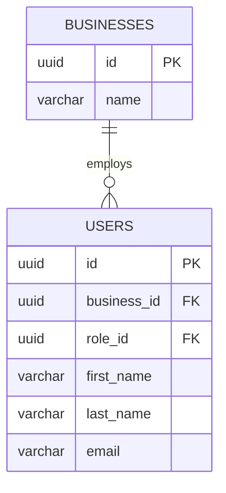
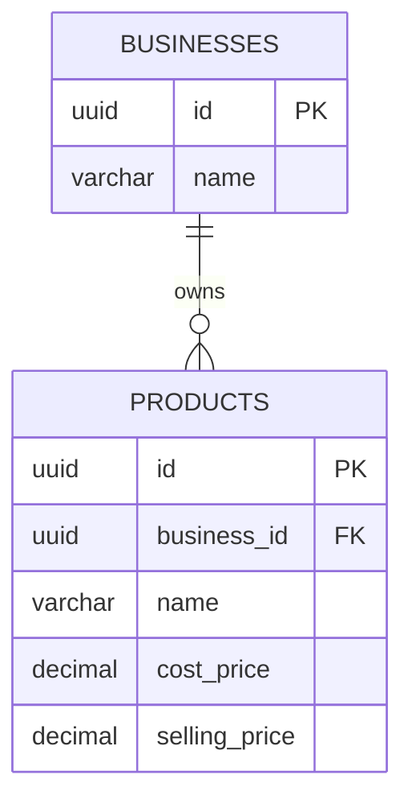
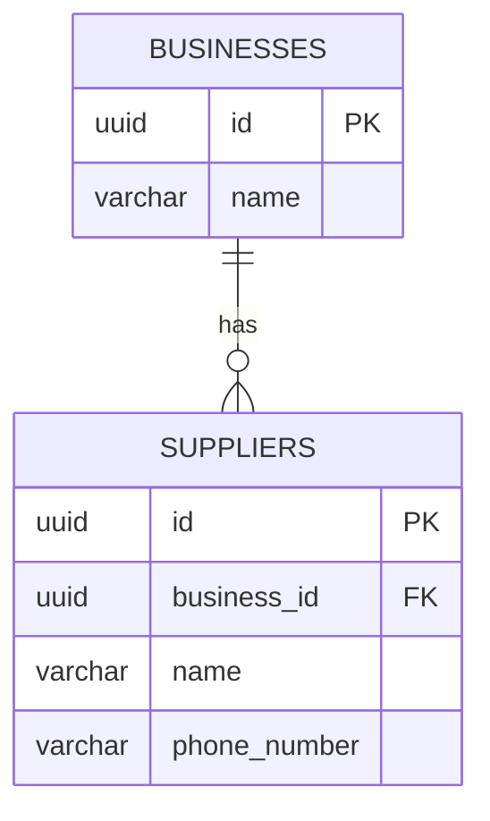
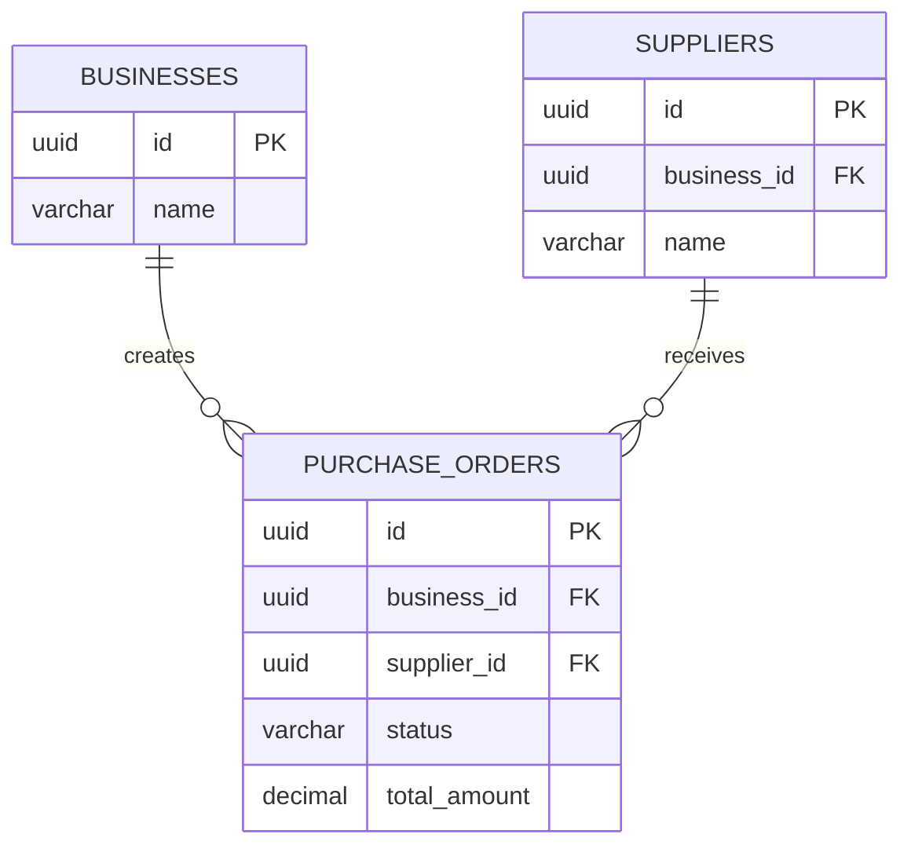
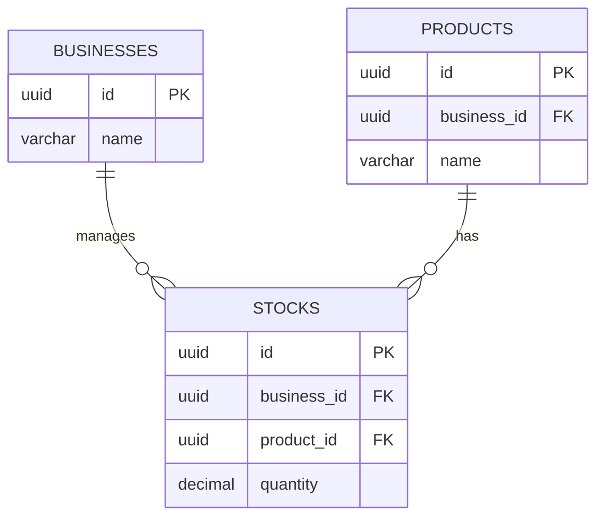
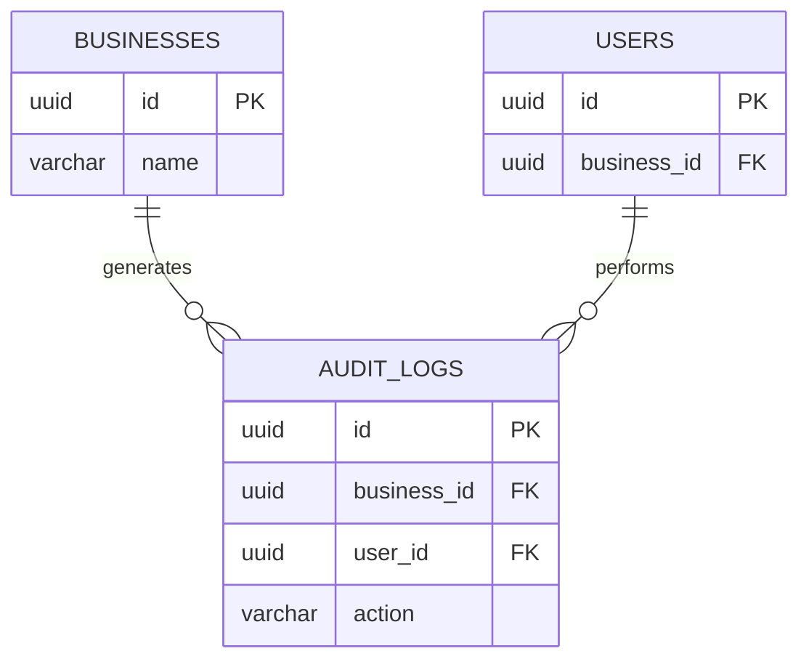

# Business Relationships

## Business → Users



One business can have many users.

```text
Business
   │
   ├── Admin
   ├── Manager
   ├── Storeman
   └── Cashier
```

The `business_id` identifies the business.

The `role_id` identifies what the user can do.

---

# Business → Products



A business can have many products.

---

# Business → Suppliers



Suppliers belong to the business that manages them.

---

# Business → Purchase Orders



The flow is:

```text
Business
   ↓
Supplier
   ↓
Purchase Order
   ↓
Receive Goods
   ↓
Stock
```

---

# Business → Stock



Conceptually:

```text
Business
   │
   └── Product
          │
          └── Stock
```

---

# Business → Audit Logs



Audit logs allow the system to answer questions such as:

```text
Who changed the stock?

Who created this product?

Who created this purchase order?

Who changed this supplier?

When did the change happen?
```
