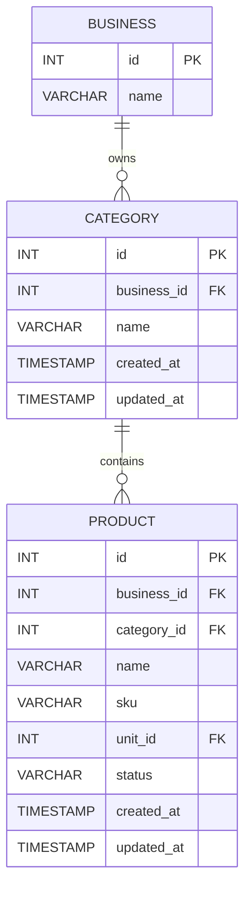

# Category Entity Relationship Diagram

## ER Diagram



## Relationships

### Business → Category

A business can have many categories.

```text
BUSINESS 1 ─────────── N CATEGORY
```

The relationship is implemented through:

```text
categories.business_id → businesses.id
```

### Category → Product

A category can contain many products.

```text
CATEGORY 1 ─────────── N PRODUCT
```

The relationship is implemented through:

```text
products.category_id → categories.id
```

## Category's Position in the Product Structure

```text
BUSINESS
   │
   │ 1:N
   ▼
CATEGORY
   │
   │ 1:N
   ▼
PRODUCT
```

For example:

```text
Business: ABC Store
│
├── Category: Beverages
│   ├── Coca-Cola
│   ├── Pepsi
│   └── Sprite
│
├── Category: Snacks
│   ├── Biscuits
│   └── Chips
│
└── Category: Household
    ├── Detergent
    └── Soap
```

## Important Design Decision

Category belongs to a **Business**, not directly to the entire system.

Therefore:

```text
business_id + name
```

defines the category's business scope.

This allows different businesses to independently maintain their own category structures.
