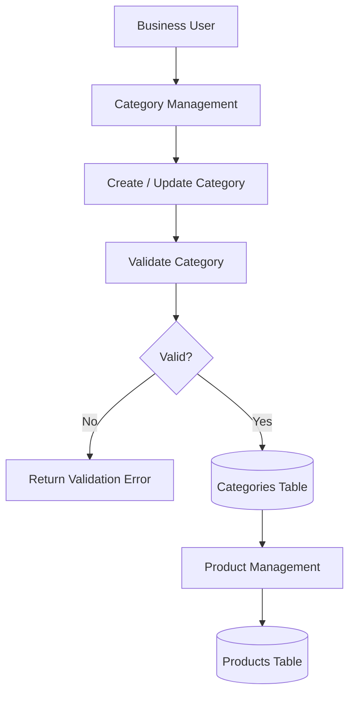
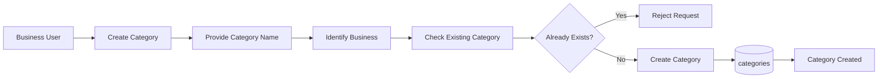
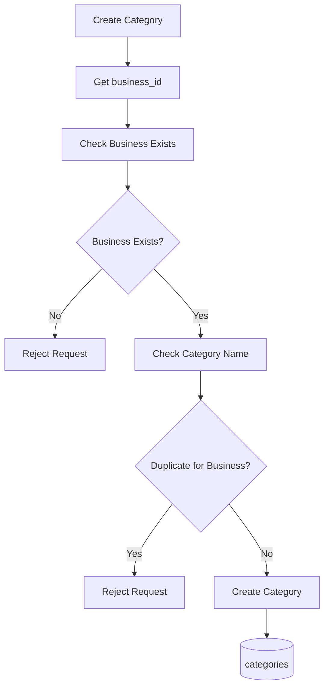
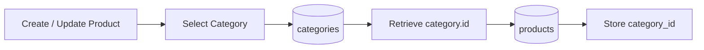
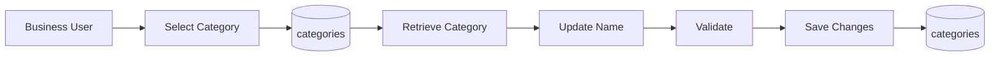
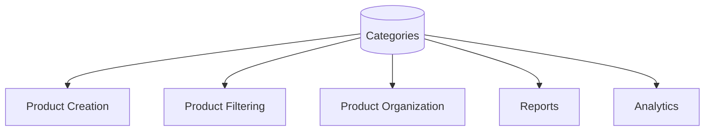

# Category Data Flow

## Overview

The Category data flow describes how categories are created, associated with businesses, retrieved, updated, and used when organizing products.

## High-Level Data Flow



## Category Creation Flow



## Category Validation Flow

A category should be validated within the context of its business.



## Product Assignment Flow

Once a category exists, products can reference it.



The relationship is:

```text
products.category_id
        │
        ▼
categories.id
```

## Complete Category Data Flow

```text
                    ┌─────────────────┐
                    │  Business User  │
                    └────────┬────────┘
                             │
                             ▼
                    ┌─────────────────┐
                    │    Category     │
                    │    Management   │
                    └────────┬────────┘
                             │
                             ▼
                    ┌─────────────────┐
                    │    Validate     │
                    │    Business     │
                    └────────┬────────┘
                             │
                             ▼
                    ┌─────────────────┐
                    │ Check Duplicate │
                    │    Category     │
                    └────────┬────────┘
                             │
                             ▼
                    ┌─────────────────┐
                    │    categories   │
                    │                 │
                    │ id              │
                    │ business_id     │
                    │ name            │
                    └────────┬────────┘
                             │
                             │ category_id
                             ▼
                    ┌─────────────────┐
                    │    products     │
                    └─────────────────┘
```

## Category Update Flow



## Category Consumption

Categories are primarily consumed by Product Management.



## Design Boundary

The Category entity answers:

> **How should products be grouped?**

It does not answer:

> What products exist?

That responsibility belongs to Product.

Therefore:

```text
CATEGORY
    │
    │ organizes
    ▼
PRODUCT
```

The Category entity should not contain product-specific information such as SKU, price, stock quantity, or unit.
