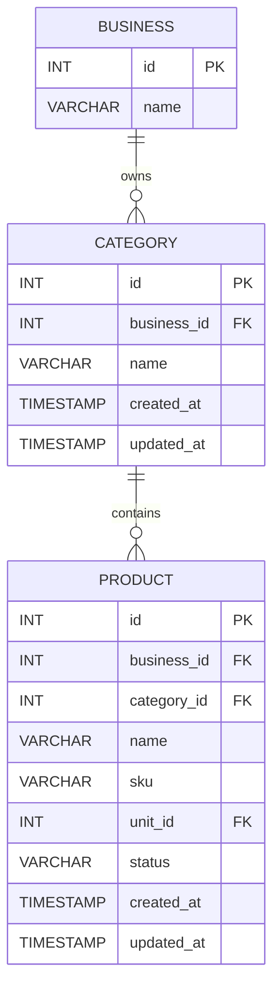

# Category Database Design

## Purpose

The Category entity provides a way for each business to organize its products into logical groups.

## Properties

```text
Category
├── id
├── business_id
├── name
├── created_at
└── updated_at
```

## Relationships

```text
BUSINESS
    │
    │ 1:N
    ▼
CATEGORY
    │
    │ 1:N
    ▼
PRODUCT
```

## ER Diagram



## Core Design Decision

Categories are **business-scoped**.

The same category name can exist for multiple businesses:

```text
Business A
└── Beverages

Business B
└── Beverages
```

These are two different category records because they belong to different businesses.

## Recommended Uniqueness

The recommended constraint is:

```text
UNIQUE(business_id, name)
```

This means:

```text
Business A + Beverages → allowed
Business A + Beverages → duplicate
Business B + Beverages → allowed
```

## Responsibility

The Category entity is responsible for:

- Grouping products
- Providing product classification
- Providing category-based filtering
- Supporting product organization
- Supporting category-based reporting

It is not responsible for:

- Product identity
- Inventory quantities
- Product pricing
- Sales
- Stock movements

Those belong to their respective entities.

## Current Scope

```text
Category
├── id
├── business_id
└── name
```

with system-managed:

```text
created_at
updated_at
```

## Future Considerations

If the system later needs nested categories, the model could be extended with:

```text
parent_category_id
```

giving:

```text
Beverages
├── Soft Drinks
│   ├── Coca-Cola
│   └── Pepsi
└── Water
    ├── Bottled Water
    └── Sachet Water
```

However, hierarchical categories should **not be introduced until the business actually requires them**.
