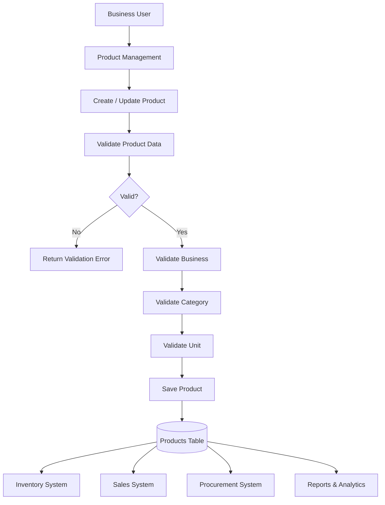
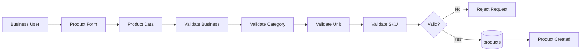
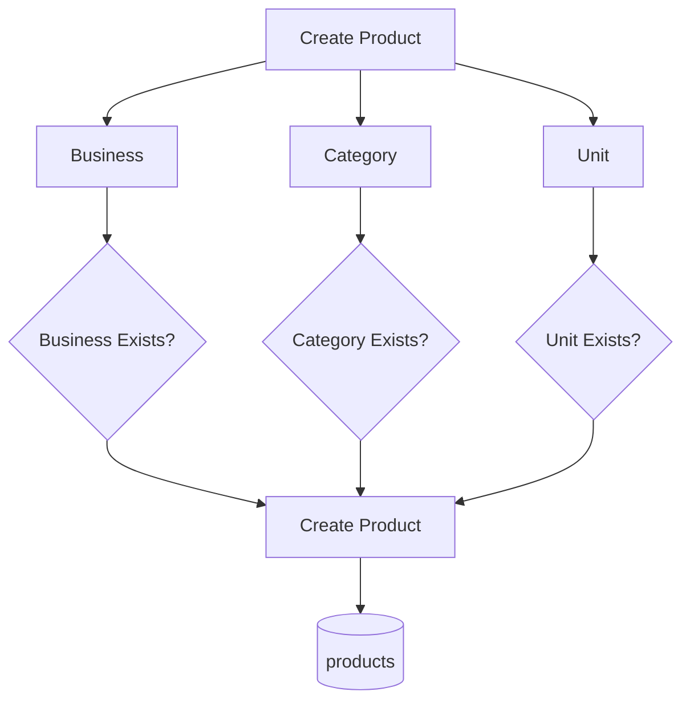
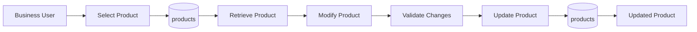
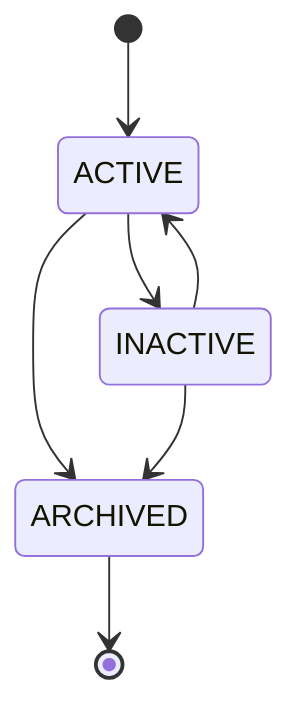
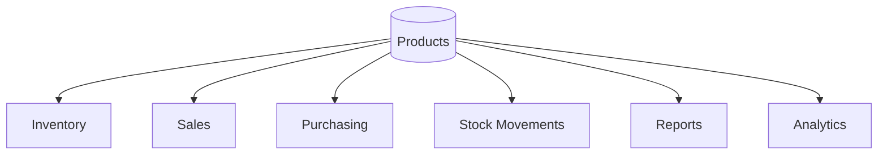

# Product Data Flow

## Overview

The Product data flow describes how product information enters the system, how it is associated with a business, category, and unit, and how it becomes available to other parts of the inventory system.

## High-Level Product Flow



## Product Creation Flow



## Data Dependencies

Before a Product can be created, the system needs to resolve its references.



The Product record therefore depends on:

```text
business_id → businesses.id
category_id → categories.id
unit_id     → units.id
```

## Product Data Movement

```text
                    ┌─────────────────┐
                    │  Business User  │
                    └────────┬────────┘
                             │
                             │ product information
                             ▼
                    ┌─────────────────┐
                    │ Product Service │
                    └────────┬────────┘
                             │
              ┌──────────────┼──────────────┐
              │              │              │
              ▼              ▼              ▼
        ┌───────────┐  ┌───────────┐  ┌───────────┐
        │ Business  │  │ Category  │  │   Unit    │
        │ Validation│  │ Validation│  │ Validation│
        └─────┬─────┘  └─────┬─────┘  └─────┬─────┘
              │              │              │
              └──────────────┼──────────────┘
                             │
                             ▼
                    ┌─────────────────┐
                    │    Products     │
                    │     Table       │
                    └────────┬────────┘
                             │
              ┌──────────────┼───────────────┐
              │              │               │
              ▼              ▼               ▼
        ┌───────────┐  ┌───────────┐  ┌────────────┐
        │ Inventory │  │   Sales   │  │ Analytics  │
        └───────────┘  └───────────┘  └────────────┘
```

## Product Update Flow



## Product Status Flow



The exact lifecycle rules should be determined by the business requirements.

## Product Consumption Flow

Once a product exists, other modules can reference it.



The Product entity therefore acts as a **central reference point** for inventory-related operations.

## Important Boundary

The Product table describes **what the business sells or manages**.

It should not directly contain operational inventory quantities such as:

```text
quantity_in_stock
quantity_sold
quantity_reserved
warehouse_quantity
```

Those are inventory/stock concerns and should be modeled separately.

The Product entity identifies the item.

The Stock entity describes the item's inventory state.

Conceptually:

```text
PRODUCT
   │
   │ identifies
   ▼
"What is this item?"

STOCK
   │
   │ tracks
   ▼
"How many do we have?"
```
