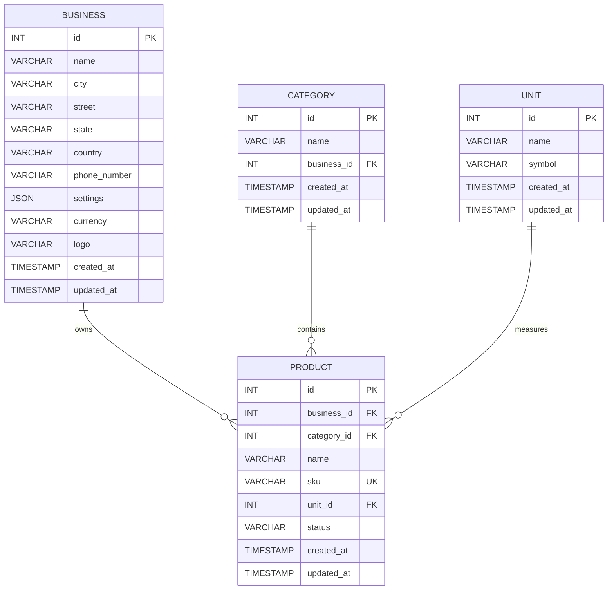

# Product Entity Relationship Diagram

## ER Diagram



## Relationships

### Business → Product

A business can have many products.

```text
BUSINESS 1 ─────────── N PRODUCT
```

The relationship is implemented through:

```text
products.business_id → businesses.id
```

### Category → Product

A category can contain many products.

```text
CATEGORY 1 ─────────── N PRODUCT
```

The relationship is implemented through:

```text
products.category_id → categories.id
```

### Unit → Product

A unit can be used by many products.

```text
UNIT 1 ─────────── N PRODUCT
```

The relationship is implemented through:

```text
products.unit_id → units.id
```

## Product's Position in the Database

```text
                         ┌──────────────┐
                         │   BUSINESS   │
                         └──────┬───────┘
                                │
                                │ 1:N
                                ▼
┌──────────────┐          ┌──────────────┐          ┌──────────────┐
│   CATEGORY   │─────────▶│   PRODUCT    │◀─────────│     UNIT     │
└──────────────┘   1:N    └──────────────┘    N:1   └──────────────┘
```

## Design Principle

The Product entity does not duplicate business, category, or unit information.

Instead, it stores references:

```text
product.business_id → business.id
product.category_id → category.id
product.unit_id → unit.id
```

This keeps the product table normalized and allows each related entity to maintain its own data.
