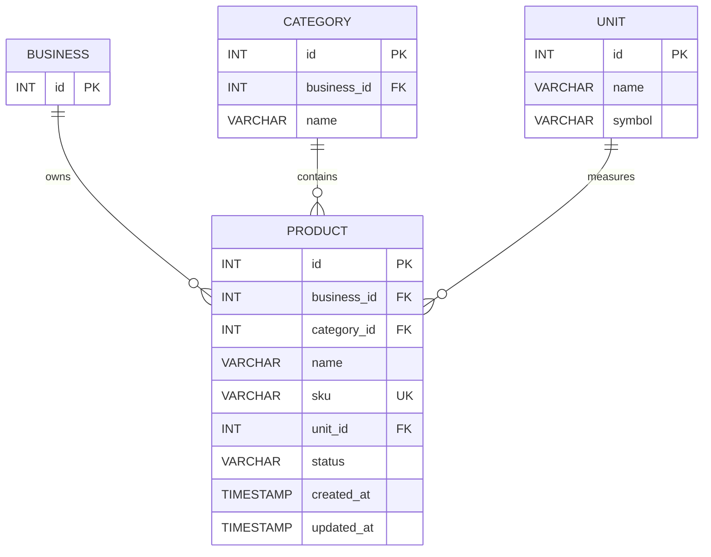
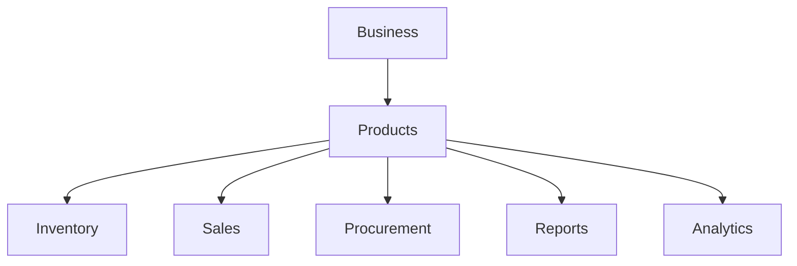

# Product Database Design

## Purpose

The Product entity represents an item that a business sells or manages.

It provides the central product identity used by inventory, sales, procurement, reporting, and other business operations.

## Properties

```text
Product
├── id
├── business_id
├── category_id
├── name
├── sku
├── unit_id
├── status
├── created_at
└── updated_at
```

## Relationships

```text
BUSINESS
    │
    │ 1:N
    ▼
PRODUCT
    ▲
    │
    ├──────── CATEGORY
    │            1:N
    │
    └──────── UNIT
                 1:N
```

More precisely:

```text
Business  1 ─────── N Product
Category  1 ─────── N Product
Unit      1 ─────── N Product
```

## ER Diagram



## Core Design Decision

The Product entity is responsible for **product identity and classification**.

It is not responsible for tracking inventory quantities.

### Product

Answers:

> What product is this?

```text
name
sku
category
unit
status
```

### Stock

Answers:

> How much of this product do we currently have?

```text
product_id
quantity
```

This separation keeps Product and Inventory as distinct concerns.

## Product's Role in the System



Products therefore become one of the core reference entities in the system.

## Current Scope

The current Product model contains:

```text
id
business_id
category_id
name
sku
unit_id
status
created_at
updated_at
```

The following concerns are intentionally excluded from Product:

- Stock quantity
- Purchase price
- Selling price
- Warehouse location
- Supplier
- Stock movements
- Sales history
- Purchase history

Those concerns should belong to their respective domains.

## Future Extensions

As the system grows, Product may connect to:

```text
Product
   │
   ├── Stock
   ├── Stock Movement
   ├── Purchase Order
   ├── Sales Order
   ├── Supplier
   └── Product Pricing
```

These relationships should be introduced only when the corresponding domains are designed.
