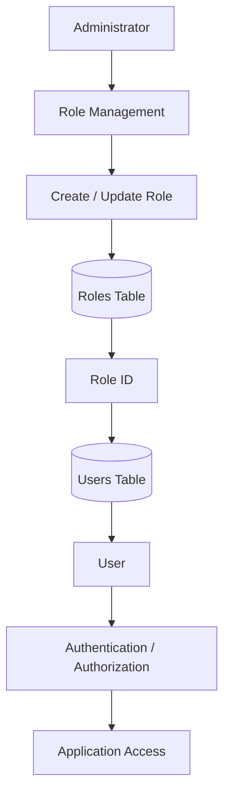
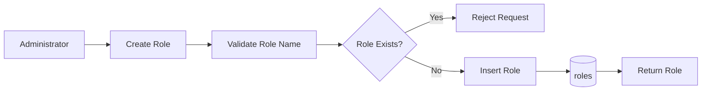
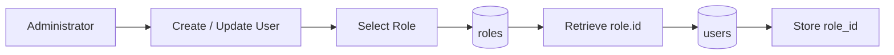
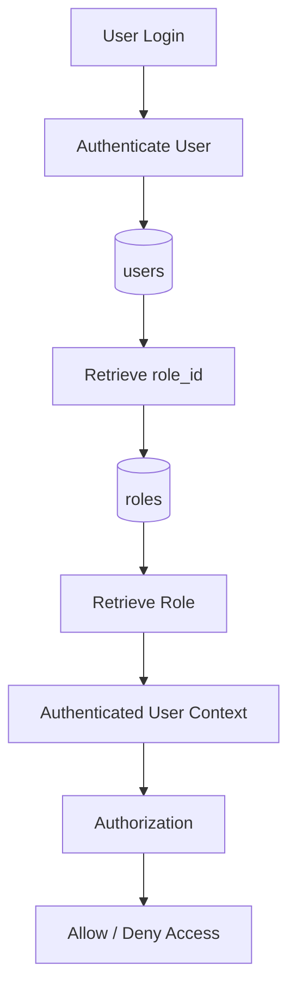
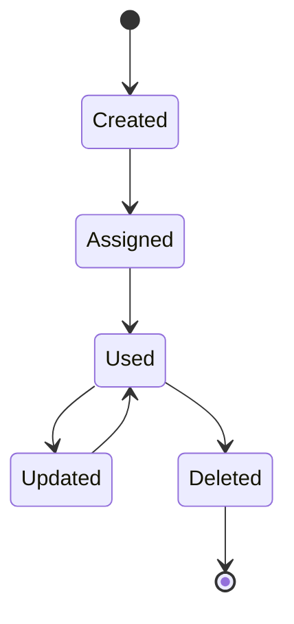

# Role Data Flow

## Overview

The Role data flow describes how roles are created, retrieved, assigned to users, and used when determining a user's role within the system.

At the current stage, the Role entity is primarily a reference entity for Users.

## High-Level Data Flow



## Role Creation Flow



### Process

1. An administrator creates a role.
2. The system receives the role name.
3. The system validates the role name.
4. The database checks whether the role already exists.
5. If it exists, the request is rejected.
6. If it does not exist, the role is stored.
7. The created role is returned.

## Role Assignment Flow



The important point is that the User does **not** store the role name.

It stores:

```text
users.role_id
```

which references:

```text
roles.id
```

## User Authentication Flow



## Data Movement

```text
                    ┌───────────────┐
                    │ Administrator │
                    └───────┬───────┘
                            │
                            │ creates/manages
                            ▼
                    ┌───────────────┐
                    │     Role      │
                    │   Management  │
                    └───────┬───────┘
                            │
                            │
                            ▼
                    ┌───────────────┐
                    │    roles      │
                    │               │
                    │ id            │
                    │ name          │
                    └───────┬───────┘
                            │
                            │ role_id
                            ▼
                    ┌───────────────┐
                    │     users     │
                    │               │
                    │ id            │
                    │ role_id       │
                    │ ...           │
                    └───────┬───────┘
                            │
                            ▼
                    ┌───────────────┐
                    │ Authorization │
                    └───────────────┘
```

## Role Lifecycle



> Note: Role deletion should be handled carefully because existing users may reference the role.

## Current Responsibility

The Role entity is responsible for:

- Defining available roles
- Providing a stable role identifier
- Giving Users a role reference
- Supporting future authorization logic

It is **not yet responsible for permissions**.

Future RBAC expansion can introduce:

```text
roles
   │
   ▼
role_permissions
   │
   ▼
permissions
```

without fundamentally changing the current Role design.
