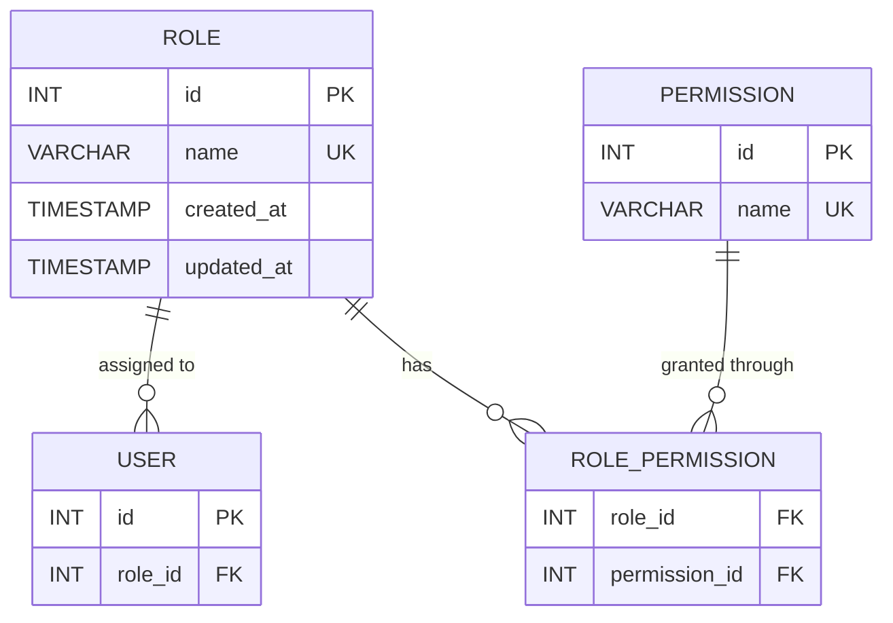

# Role Database Design

## Purpose

The Role entity defines the roles available within the system and provides a reference that can be assigned to users.

## Files

```text
role/
├── README.md
├── role-schema.md
├── role-er-diagram.md
└── role-data-flow.md
```

## Entity

```text
Role
├── id
├── name
├── created_at
└── updated_at
```

## Relationship

```text
ROLE
  │
  │ 1
  │
  │ N
  ▼
USER
```

A Role can be assigned to many Users.

## Database Relationship

```text
roles.id
    ▲
    │
    │ FK
    │
users.role_id
```

## Architectural Principle

The Role entity is kept separate from User because **a role is its own domain concept**.

The User references a Role instead of storing role information directly.

This gives the system a clean foundation for expanding into RBAC later:



The `ROLE_PERMISSION` and `PERMISSION` entities are **future extensions** and are not part of the current Role implementation.

## Current Scope

For the current version:

```text
Role
├── id
└── name
```

with system-managed timestamps:

```text
created_at
updated_at
```

The design intentionally avoids introducing unnecessary RBAC complexity until permissions are actually required.
