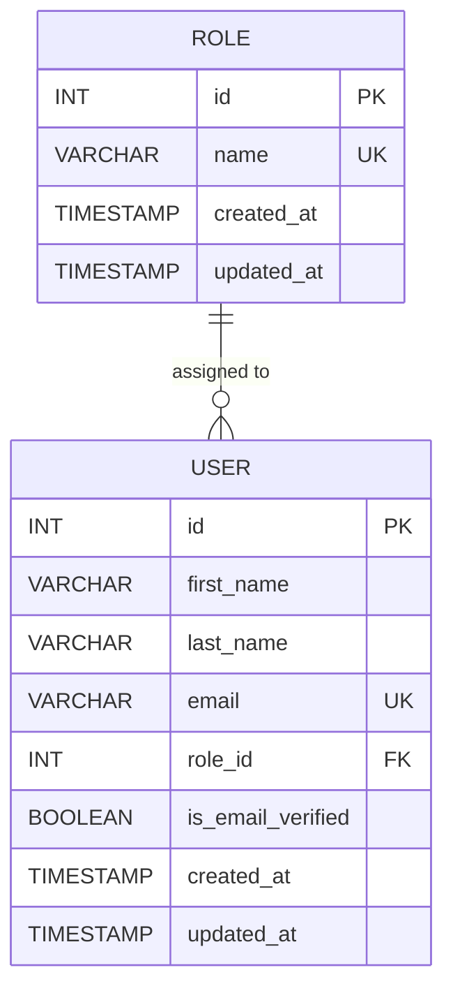

# Role Entity Relationship Diagram

## ER Diagram



## Relationship Explanation

### ROLE → USER

A single role can be assigned to multiple users.

For example:

```text
ADMIN
 ├── User A
 ├── User B
 └── User C
```

Therefore:

```text
ROLE 1 ─────────── N USER
```

The relationship is implemented through:

```text
users.role_id → roles.id
```

## Cardinality

| Entity | Relationship | Entity |
| ------ | ------------ | ------ |
| Role   | One-to-Many  | User   |
| User   | Many-to-One  | Role   |

## Important Design Decision

The User table stores the foreign key:

```text
role_id
```

rather than storing the role name directly:

```text
role = "ADMIN"
```

This prevents duplicated role information across users.

Instead:

```text
users.role_id = 1
```

references:

```text
roles.id = 1
roles.name = "ADMIN"
```

This keeps the database normalized.
