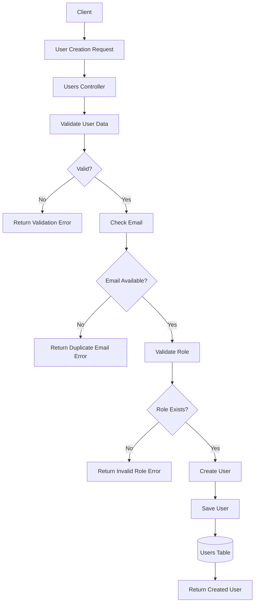
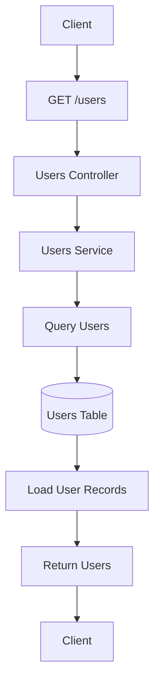
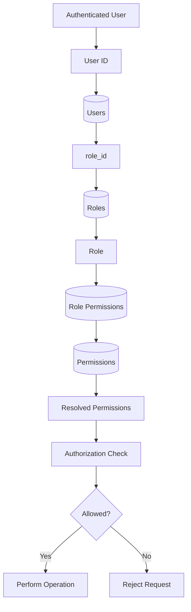
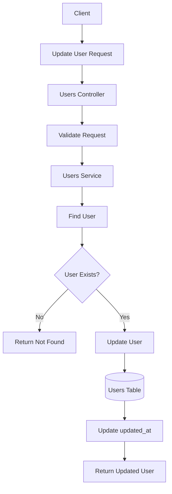
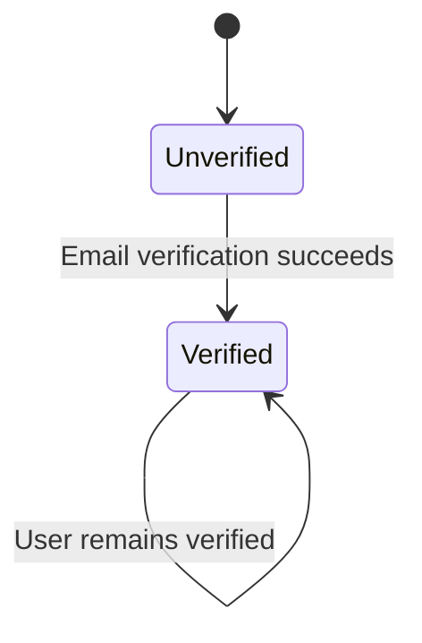
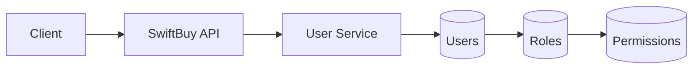

# User Entity — Data Flow

## 1. Overview

The User data flow describes how user information moves through SwiftBuy when a user is created, retrieved, updated, and authorized.

The User entity interacts primarily with:

```text
Client
   │
   ▼
API
   │
   ▼
User Service
   │
   ▼
Users Database
   │
   ▼
Role / Permission System
```

---

# 2. User Creation Flow



---

# 3. User Retrieval Flow



---

# 4. User With Role Flow

When the application needs to determine what a user can do:



---

# 5. User Update Flow



---

# 6. Email Verification State

The User entity maintains only the state of verification:

```text
is_email_verified
```

The state transition is:

```text
false
  │
  │ successful verification
  ▼
true
```

Conceptually:



The actual email verification mechanism belongs to the authentication/application layer.

---

# 7. Authorization Data Flow

The complete authorization flow is:

```text
Request
   │
   ▼
Authenticated User
   │
   ▼
User
   │
   │ role_id
   ▼
Role
   │
   ▼
Role Permissions
   │
   ▼
Permissions
   │
   ▼
Authorization Decision
   │
   ├── Allowed
   │
   └── Denied
```

---

# 8. Simplified System Data Flow



---

# 9. Responsibilities

### Client

Responsible for:

- Sending user information.
- Requesting user data.
- Requesting user updates.

### Users Controller

Responsible for:

- Receiving HTTP requests.
- Validating request DTOs.
- Returning HTTP responses.

### Users Service

Responsible for:

- User business logic.
- User creation.
- User retrieval.
- User updates.
- User-role validation.

### Users Table

Responsible for:

- Persisting user identity.
- Persisting account state.
- Persisting role assignment.
- Maintaining timestamps.

### Roles

Responsible for:

- Defining user roles.

### Permissions

Responsible for:

- Defining individual system capabilities.

### Role Permissions

Responsible for:

- Connecting roles to permissions.

---

# 10. Core Principle

The User data flow should remain simple:

```text
User Data
    ↓
User Service
    ↓
Users Table
```

Authorization should remain separate:

```text
User
    ↓
Role
    ↓
Permissions
```

This prevents the User entity from becoming responsible for authentication, authorization, business operations, and security simultaneously.
