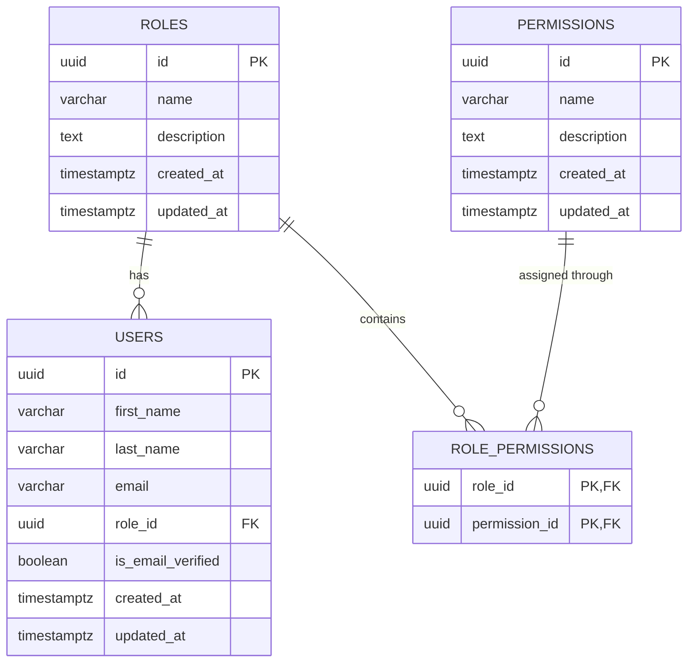

# User Entity — ER Diagram

## 1. Overview

The User entity participates primarily in the authorization system through its relationship with the `roles` table.

The core relationship is:

```text
User → Role → Permissions
```

---

## 2. Mermaid ER Diagram



---

# 3. Relationship Explanation

## Users → Roles

```text
ROLES ||--o{ USERS
```

This means:

> One Role can be assigned to many Users.

But:

> Each User has one Role.

Example:

```text
MANAGER
   │
   ├── User A
   ├── User B
   └── User C
```

---

## Roles → Permissions

A role does not directly contain permissions as a JSON array or list.

Instead, the relationship is handled through:

```text
role_permissions
```

Therefore:

```text
Role
  │
  ▼
RolePermission
  │
  ▼
Permission
```

This creates a many-to-many relationship:

```text
Role N ───────── N Permission
```

---

# 4. Complete Authorization Relationship

```text
┌──────────────┐
│    USERS     │
│              │
│ id           │
│ role_id      │
└──────┬───────┘
       │
       │ N:1
       ▼
┌──────────────┐
│    ROLES     │
│              │
│ id           │
│ name         │
└──────┬───────┘
       │
       │ 1:N
       ▼
┌────────────────────┐
│  ROLE_PERMISSIONS  │
│                    │
│ role_id            │
│ permission_id      │
└─────────┬──────────┘
          │
          │ N:1
          ▼
┌────────────────┐
│  PERMISSIONS   │
│                │
│ id             │
│ name           │
└────────────────┘
```

---

# 5. Example

Suppose:

```text
User:
John Doe
```

John has:

```text
role_id = manager-id
```

The database resolves:

```text
users
   │
   ▼
roles
   │
   │ MANAGER
   ▼
role_permissions
   │
   ▼
permissions
```

John can therefore inherit all permissions assigned to the `MANAGER` role.

---

# 6. Design Principle

The User table answers:

> **Who is this person?**

The Role table answers:

> **What category of user are they?**

The Permission table answers:

> **What can they do?**

The `role_permissions` table connects the two authorization concepts.

This prevents the User entity from becoming responsible for the entire authorization system.
