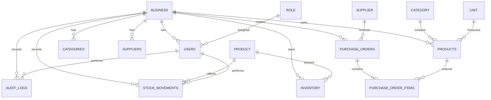

# SwiftBuy V1 Database Design

## Overview

This document describes the simplified database design for the SwiftBuy V1 inventory and procurement system.

The V1 design focuses on the core problems SwiftBuy needs to solve:

- Product management
- Inventory management
- Supplier management
- Purchase orders
- Stock receiving
- Stock movement tracking
- Inventory adjustments
- Accountability and auditability
- Basic role-based access

SwiftBuy V1 assumes **one inventory location per business**.

Multi-store and multi-location inventory will be introduced in a future version.

The design intentionally avoids implementing advanced functionality until there is a demonstrated business requirement for it.

---

# 1. V1 Design Principles

SwiftBuy V1 follows these principles:

1. A business owns its users, products, suppliers, inventory, and operational records.
2. V1 operates with a single inventory location per business.
3. Products describe what the business sells or stores.
4. Inventory describes the current quantity of a product.
5. Stock movements describe how inventory changes.
6. Different stock events remain distinguishable.
7. Historical stock movements should not be silently rewritten.
8. Corrections should use reversal records rather than deleting historical events.
9. Critical actions should be auditable.
10. Purchase orders represent intended purchases, not received inventory.
11. Stock should only increase when goods are actually received.
12. Stock adjustments require investigation and appropriate approval.
13. The database should remain simple enough for V1 while leaving room for future expansion.

---

# 2. V1 Entity Relationship Diagram



---

# 3. Core V1 Tables

The initial database contains the following tables:

```text
business

users

roles

products

categories

units

suppliers

purchase_orders

purchase_order_items

inventory

stock_movements

audit_logs
```

Future versions may introduce additional tables without requiring V1 to model every possible inventory scenario.

---

# 4. Business

The `business` table represents the business using SwiftBuy.

```text
business
--------
id
name
city
street
state
country
phone_number
settings
currency
logo
deletedAt
created_at
updated_at
```

## Responsibilities

A business owns:

- Users
- Products
- Categories
- Suppliers
- Purchase orders
- Inventory
- Stock movements
- Audit logs

Every business-owned record should be associated with a business.

---

# 5. Users

The `users` table represents people who interact with SwiftBuy.

```text
users
-----
id
first_name
last_name
email
role_id
is_email_verified
created_at
updated_at
```

A user belongs to a business and has a role.

Users are responsible for actions such as:

- Creating products
- Creating purchase orders
- Receiving stock
- Performing sales-related operations
- Reporting discrepancies
- Approving actions where their role permits it

---

# 6. Roles

Roles provide the initial level of authorization.

```text
roles
-----
id
name
```

Initial V1 roles:

```text
ADMIN
MANAGER
STOREKEEPER
CASHIER
```

## V1 Authorization Principle

V1 should avoid an unnecessarily complicated permission system.

Roles provide the basic authorization boundary.

More granular permissions can be introduced later when real business requirements justify them.

---

# 7. Products

The `products` table describes products managed by the business.

```text
products
--------
id
business_id
category_id
name
sku
unit_id
status
created_at
updated_at
```

## Important distinction

A product describes:

> What is this?

Inventory describes:

> How much of it do we currently have?

Therefore, the current inventory quantity should not be stored as the primary state on the product itself.

---

# 8. Categories

Categories organize products.

```text
categories
----------
id
business_id
name
```

Example:

```text
Clothing
Electronics
Food
Beverages
```

V1 keeps categories simple.

Hierarchical or nested categories can be introduced later if required.

---

# 9. Units

Units define how product quantities are expressed.

```text
units
-----
id
name
symbol
```

Examples:

```text
Piece
Bottle
Bag
Kilogram
Litre
Carton
```

## V1 Scope

V1 supports a product having a defined unit.

Advanced unit conversion is intentionally deferred.

For example, V1 does not need to solve:

```text
1 carton = 12 bottles
1 dozen = 12 pieces
1 crate = 24 bottles
```

until the actual business workflows requiring these conversions are properly understood.

---

# 10. Suppliers

Suppliers represent businesses or individuals that provide products.

```text
suppliers
---------
id
business_id
name
phone
email
address
status
created_at
updated_at
```

A business can have multiple suppliers.

---

# 11. Purchase Orders

Purchase orders represent intended purchases from suppliers.

```text
purchase_orders
---------------
id
business_id
supplier_id
created_by
approved_by
status
created_at
updated_at
```

## Basic V1 Lifecycle

```text
DRAFT
   ↓
PENDING_APPROVAL
   ↓
APPROVED
   ↓
RECEIVING
   ↓
RECEIVED
```

The exact statuses may evolve as the purchasing workflow becomes clearer.

---

# 12. Purchase Order Items

Each purchase order contains one or more products.

```text
purchase_order_items
--------------------
id
purchase_order_id
product_id
quantity
unit_price
```

Example:

```text
PO-001

Polo       50
Shirt      30
Trousers   20
```

A purchase order describes what the business intends to buy.

It does **not** automatically increase inventory.

---

# 13. Purchase Order Approval

Only users with the appropriate authority should approve purchase orders.

For example:

```text
Storekeeper
     │
     │ creates
     ▼
Purchase Order
     │
     ▼
Pending Approval
     │
     │
     ▼
Manager / Higher Role
     │
     │ approves
     ▼
Approved
```

The exact role hierarchy should be defined as part of the authorization design.

---

# 14. Inventory

The `inventory` table represents the current quantity of a product.

```text
inventory
---------
id
business_id
product_id
quantity
updated_at
```

Because V1 assumes one inventory location per business, there is intentionally **no `store_id` or `location_id`**.

Example:

```text
Product       Quantity

Polo              100
Shirt              50
Trousers           30
```

The inventory table represents the current state.

---

# 15. Stock Movements

`stock_movements` records changes to inventory.

```text
stock_movements
---------------
id
business_id
product_id

type
quantity

reference_type
reference_id

performed_by
created_at
```

## Initial V1 Movement Types

```text
RECEIPT
SALE
DAMAGE
LOSS
ADJUSTMENT
REVERSAL
```

Different business events remain distinguishable.

For example:

```text
SALE
-5

DAMAGE
-2

LOSS
-3

ADJUSTMENT
-1
```

All four may reduce inventory, but they represent different operational events.

---

# 16. Inventory and Stock Movement Relationship

Inventory represents the **current state**.

Stock movements represent the **history of changes**.

```text
INVENTORY
    │
    │ current state
    ▼
100 units
```

While the movements might show:

```text
Opening Balance       +100

Sale                    -5

Damage                  -2

Receipt                +20

Adjustment              -3
--------------------------------
Current Balance        110
```

Therefore:

```text
Inventory
=
Current State

Stock Movements
=
Historical Events
```

---

# 17. Stock Movement Principle

Inventory changes should happen as the result of a valid business event.

Conceptually:

```text
Business Event
      │
      ▼
Stock Movement
      │
      ▼
Inventory Update
      │
      ▼
Audit Trail
```

Example:

```text
Goods Received
      │
      ▼
RECEIPT +50
      │
      ▼
Inventory +50
      │
      ▼
Audit Log
```

---

# 18. Receiving Stock

Receiving stock is different from creating a purchase order.

A purchase order says:

> We intend to receive these goods.

Receiving says:

> These goods physically arrived and were accepted into inventory.

The V1 flow is:

```text
Purchase Order
      │
      ▼
Approved
      │
      ▼
Goods Arrive
      │
      ▼
Authorized Person Receives
      │
      ▼
Physical Verification
      │
      ▼
Accepted Quantity
      │
      ▼
Stock Movement: RECEIPT
      │
      ▼
Inventory Updated
```

---

# 19. Receiving Verification

A receiving user should verify the physical goods before increasing inventory.

The system should not blindly assume:

```text
Ordered = Received
```

For example:

```text
Purchase Order:

80 units ordered
```

The receiver physically verifies:

```text
80 units physically present
```

Only goods in acceptable/perfect condition should be received into usable inventory.

If:

```text
80 ordered
75 acceptable
5 damaged
```

then the system should not simply add 80 usable units.

The receiving process should capture the accepted quantity and identify the discrepancy.

---

# 20. Receiving Discrepancies

A discrepancy can occur when:

```text
Ordered Quantity
        ≠
Physically Received Quantity
```

or when some received goods are not acceptable.

Example:

```text
Ordered:       100
Received:       95
Accepted:       90
Damaged:         5
```

The system should preserve this information rather than silently changing the purchase order.

This information can later help SwiftBuy identify recurring supplier or operational problems.

---

# 21. Inventory Adjustments

Inventory adjustments are treated as sensitive operations.

A user should not simply change:

```text
100 → 80
```

without explanation.

The V1 conceptual flow is:

```text
Discrepancy Noticed
        │
        ▼
Investigation
        │
        ▼
Adjustment Proposed
        │
        ▼
Manager / Supervisor Review
        │
        ▼
Approved
        │
        ▼
Stock Movement
        │
        ▼
Inventory Updated
        │
        ▼
Audit Trail
```

---

# 22. Adjustment Investigation

The purpose of investigation is not only to approve or reject a number.

It should help answer:

- What happened?
- Why is the inventory different?
- When did the discrepancy occur?
- Who noticed it?
- What evidence exists?
- Is this a recurring problem?
- Can the underlying process be improved?

This supports the long-term objective of allowing SwiftBuy to identify recurring operational problems.

---

# 23. Who Can Report a Discrepancy?

Any authorized user who notices a discrepancy should be able to report it.

For example:

```text
Cashier
Storekeeper
Manager
Admin
```

The important distinction is:

> The person who notices the problem does not necessarily have the authority to approve the correction.

This separation improves accountability.

---

# 24. Adjustment Approval

A higher-level user should approve inventory adjustments.

Conceptually:

```text
Person notices discrepancy
        │
        ▼
Investigation
        │
        ▼
Adjustment proposal
        │
        ▼
Manager / Supervisor
        │
        ├── Reject
        │
        └── Approve
               │
               ▼
        Stock Movement
               │
               ▼
          Inventory
```

This prevents users from freely manipulating inventory balances.

---

# 25. Reversals

Historical stock movements should not simply be deleted.

If a movement was incorrect, create a reversal.

Example:

```text
Original:

SALE
-5 units
```

Correction:

```text
REVERSAL
+5 units
```

The original event remains visible.

Therefore:

```text
SALE
-5

REVERSAL
+5

NET EFFECT
0
```

This preserves historical accountability.

---

# 26. Audit Logs

Audit logs record important actions performed by users.

```text
audit_logs
----------
id
business_id
user_id

action
entity
entity_id

created_at
```

Audit logs answer:

> Who performed the action?

> What action was performed?

> Which record was affected?

Example:

```text
User:
John

Action:
APPROVE_PURCHASE_ORDER

Entity:
purchase_order

Entity ID:
PO-102

Timestamp:
2026-08-08 10:32
```

---

# 27. Inventory vs Stock Movement vs Audit Log

These three concepts must remain separate.

## Inventory

Answers:

> How much do we currently have?

```text
Polo
100 units
```

## Stock Movement

Answers:

> How did the quantity change?

```text
SALE
-5 units
```

## Audit Log

Answers:

> Who performed the action?

```text
John
SALE
Polo
```

Conceptually:

```text
                BUSINESS EVENT
                       │
                       ▼
                STOCK MOVEMENT
                       │
                       ▼
               INVENTORY BALANCE


                  USER ACTION
                       │
                       ▼
                  AUDIT LOG
```

---

# 28. Business Event Flow

The general inventory flow is:

```text
                  BUSINESS EVENT
                        │
          ┌─────────────┼─────────────┐
          │             │             │
          ▼             ▼             ▼
       RECEIPT         SALE        ADJUSTMENT
          │             │             │
          │             │       Investigation
          │             │             │
          │             │          Approval
          │             │             │
          └─────────────┼─────────────┘
                        ▼
                STOCK MOVEMENT
                        │
                        ▼
                  INVENTORY
                        │
                        ▼
                   AUDIT LOG
```

---

# 29. Procurement Flow

The V1 procurement flow is:

```text
User
 │
 ▼
Create Purchase Order
 │
 ▼
Pending Approval
 │
 ▼
Authorized User Approves
 │
 ▼
Supplier
 │
 ▼
Goods Arrive
 │
 ▼
Authorized Receiver
 │
 ▼
Physical Verification
 │
 ▼
Accepted Goods
 │
 ▼
RECEIPT Stock Movement
 │
 ▼
Inventory Updated
```

---

# 30. Purchase Order vs Stock

A purchase order and inventory must remain separate.

For example:

```text
PO-001

Polo
100 units
```

does not mean:

```text
Inventory
+100
```

until the goods have actually been received and accepted.

This distinction prevents the system from reporting stock that does not physically exist.

---

# 31. Auditability

Critical operations should produce an audit trail.

Examples:

```text
LOGIN
PRODUCT_CREATED
PRODUCT_UPDATED

PURCHASE_ORDER_CREATED
PURCHASE_ORDER_APPROVED
PURCHASE_ORDER_REJECTED

STOCK_RECEIVED
STOCK_ADJUSTMENT_REQUESTED
STOCK_ADJUSTMENT_APPROVED
STOCK_ADJUSTMENT_REJECTED

STOCK_MOVEMENT_CREATED
STOCK_MOVEMENT_REVERSED
```

The exact action list can evolve during implementation.

---

# 32. V1 Data Flow

```text
                    BUSINESS
                       │
          ┌────────────┼─────────────┐
          │            │             │
        USERS       PRODUCTS      SUPPLIERS
          │            │             │
          │            │             ▼
          │            │       PURCHASE ORDERS
          │            │             │
          │            │             ▼
          │            │        PO ITEMS
          │            │             │
          │            │             ▼
          │            │          PRODUCTS
          │            │
          │            ▼
          │        INVENTORY
          │            ▲
          │            │
          │      STOCK MOVEMENTS
          │            ▲
          │            │
          └────────────┤
                       │
                       ▼
                  AUDIT LOGS
```

---

# 33. Core V1 Mental Model

The simplest way to understand the database is:

```text
PRODUCT
"What is it?"

      +

INVENTORY
"How much do we have?"

      +

STOCK MOVEMENT
"How did it change?"

      +

AUDIT LOG
"Who did what?"

      +

PURCHASE ORDER
"What do we intend to buy?"

      +

SUPPLIER
"Who are we buying from?"
```

---

# 34. V1 Tables and Their Questions

| Table                  | Question it answers                     |
| ---------------------- | --------------------------------------- |
| `business`             | Whose data is this?                     |
| `users`                | Who uses SwiftBuy?                      |
| `roles`                | What authority do they have?            |
| `products`             | What products does the business manage? |
| `categories`           | How are products organized?             |
| `units`                | What unit measures the product?         |
| `suppliers`            | Who supplies the business?              |
| `purchase_orders`      | What are we trying to buy?              |
| `purchase_order_items` | What products are in the order?         |
| `inventory`            | How much do we currently have?          |
| `stock_movements`      | How did inventory change?               |
| `audit_logs`           | Who performed important actions?        |

---

# 35. V1 Scope

## Included

```text
✓ Business
✓ Users
✓ Roles
✓ Product management
✓ Categories
✓ Units
✓ Supplier management
✓ Purchase orders
✓ Purchase order items
✓ Purchase approval
✓ Stock receiving
✓ Inventory balances
✓ Stock movements
✓ Inventory adjustments
✓ Adjustment investigation
✓ Adjustment approval
✓ Reversals
✓ Audit logs
```

---

# 36. Explicitly Deferred

The following are intentionally outside the V1 database design:

```text
○ Multi-store support
○ Multiple inventory locations
○ Inter-store transfers
○ Advanced unit conversion
○ Unit conversion versioning
○ Warehouse/bin management
○ Batch management
○ Expiry tracking
○ Manufacturing
○ Advanced sales/POS
○ Accounting
○ Tax engine
○ Event streaming
○ Microservices
○ AI recommendations
○ Automated anomaly detection
```

Multi-store support will be introduced in a future version after the single-location inventory model has been validated.

---

# 37. Future Expansion Direction

The V1 inventory model is:

```text
BUSINESS
   │
   ▼
PRODUCT
   │
   ▼
INVENTORY
```

A future multi-store version could evolve toward:

```text
BUSINESS
   │
   ├── STORE A ──┐
   ├── STORE B ──┼── INVENTORY
   └── STORE C ──┘
```

This means V1 does not need to carry unnecessary location complexity today.

However, implementation should avoid making the V1 code so rigid that introducing locations later becomes impossible.

---

# 38. Final V1 Architecture

```text
                         BUSINESS
                            │
          ┌─────────────────┼─────────────────┐
          │                 │                 │
          ▼                 ▼                 ▼
        USERS            PRODUCTS          SUPPLIERS
          │                 │                 │
          │                 │                 ▼
          │                 │          PURCHASE ORDERS
          │                 │                 │
          │                 │                 ▼
          │                 │          PO ITEMS
          │                 │
          │                 ▼
          │             INVENTORY
          │                 ▲
          │                 │
          │          STOCK MOVEMENTS
          │                 ▲
          │                 │
          └─────────────────┤
                            │
                            ▼
                       AUDIT LOGS
```

The core V1 principle is:

```text
Purchase
   ↓
Approval
   ↓
Receiving
   ↓
Stock Movement
   ↓
Inventory

Inventory discrepancy
   ↓
Investigation
   ↓
Approval
   ↓
Stock Movement
   ↓
Inventory

Every critical action
   ↓
Audit Trail
```

SwiftBuy V1 should therefore remain a **single-location, inventory-focused system with procurement and accountability at its core**.

The objective is not to model every possible inventory business from day one.

The objective is to build a reliable foundation that can later evolve into multi-store, advanced procurement, analytics, and intelligent operational recommendations.
