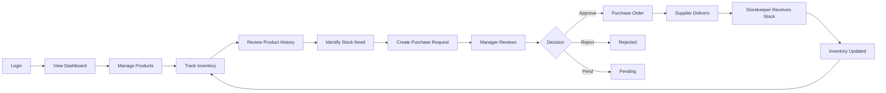

# SwiftBuy MVP User Journey

## Key User Journeys

### Owner / Admin

Login → Dashboard → Inventory & Reports → Review purchasing activity → Monitor business

### Inventory Manager

Dashboard → Check stock → Review product history → Identify need → Create/review purchase request → Approve/Reject/Pend

### Storekeeper

Dashboard → Check stock → Count/receive inventory → Record discrepancy → Inventory updated

### Supplier

Receive purchase order → Fulfill order → Deliver stock

## Core Journey

> **Track → Understand → Decide → Purchase → Receive → Update → Repeat**
