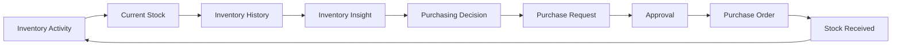
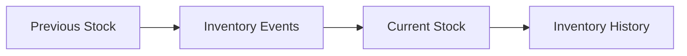
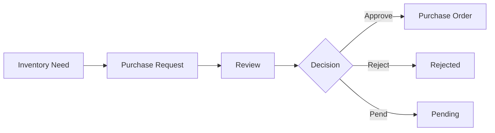
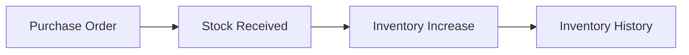
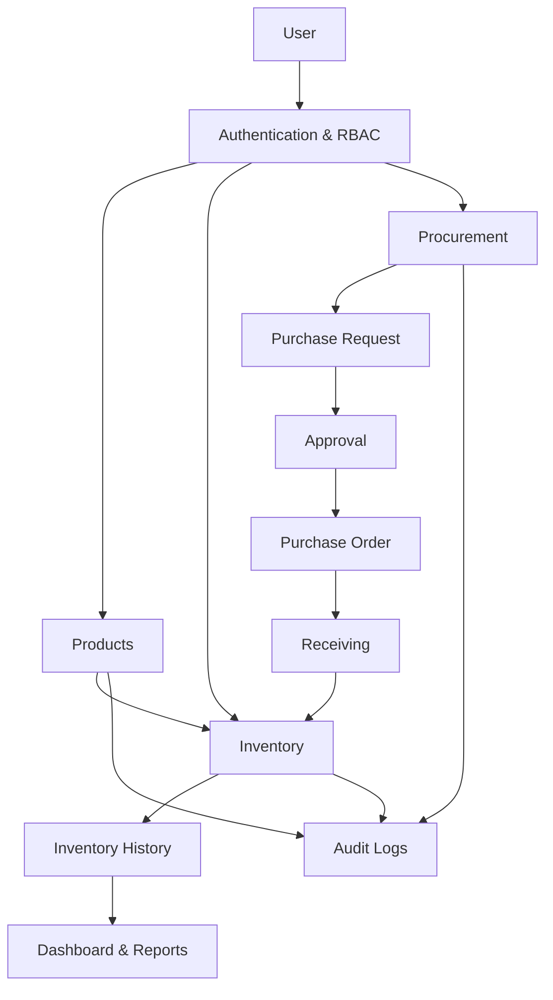
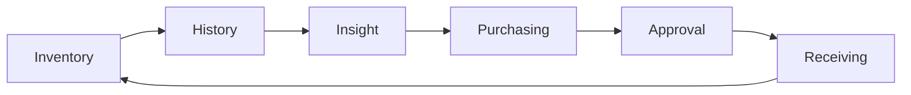

# SwiftBuy MVP Requirements

## 1. MVP Objective

SwiftBuy helps SMEs maintain a reliable view of their inventory, understand product movement, and make informed purchasing decisions.

> **Know what we have → Understand what happened → Decide what to buy → Control the purchase → Receive stock**

---

## 2. Core Business Loop

## 3. MVP Users

| Role              | Responsibility                                     |
| ----------------- | -------------------------------------------------- |
| Owner / Admin     | Business oversight, reports, approvals             |
| Inventory Manager | Inventory monitoring and purchasing decisions      |
| Storekeeper       | Stock counting, receiving and inventory operations |
| Supplier          | Supplier information and purchase fulfillment      |

---

## 4. MVP Requirements

### 4.1 Authentication & RBAC

SwiftBuy must:

- Authenticate users.
- Support role-based access control.
- Restrict actions based on permissions.
- Associate important actions with the responsible user.

### 4.2 Product Management

Authorized users must be able to:

- Create products.
- Update products.
- Categorize products.
- Define product units.
- Assign SKUs.
- Activate/deactivate products.

### 4.3 Inventory Management

SwiftBuy must:

- Maintain current stock quantities.
- Allow users to view stock at a glance.
- Record inventory-changing events.
- Maintain inventory history.
- Support physical stock counting.
- Support controlled stock adjustments.

### Inventory Principle

> **Current stock must be explainable through inventory history.**

### 4.4 Inventory History

Each inventory-changing event should record:

- Product
- Quantity change
- Date/time
- Reason/event
- User responsible

Initial movement types are hypotheses and may include:

- Stock received
- Sales / stock-out
- Damaged goods
- Stock count correction

### 4.5 Suppliers

Authorized users must be able to:

- Create suppliers.
- Update supplier information.
- Associate suppliers with purchase orders.
- View basic supplier purchasing history.

> **Supplier portal and supplier payments are excluded from V1.**

### 4.6 Purchase Requests

SwiftBuy must allow authorized users to create purchase requests containing:

- Product
- Quantity
- Supplier where applicable
- Reason/context
- Requesting user
- Status

### 4.7 Purchase Approval

Authorized managers must be able to:

- Review purchase requests.
- View relevant inventory information/history.
- Approve requests.
- Reject requests.
- Pend requests.
- Edit requests where permitted.

### Purchasing Flow

### 4.8 Purchase Orders

SwiftBuy must allow authorized users to:

- Create purchase orders from approved requests.
- Specify supplier.
- Specify products and quantities.
- Track order status.
- Track outstanding quantities.

### 4.9 Receiving

### 4.10 Dashboard

The dashboard must provide visibility into:

- Current inventory
- Products requiring attention
- Recent inventory activity
- Pending purchases
- Outstanding purchase orders

### 4.11 Reports

V1 reports should focus on:

- Current inventory
- Inventory movement/history
- Stock adjustments
- Purchase history
- Purchase order status
- Inventory value where applicable

### 4.12 Audit Logs

SwiftBuy must record important business actions, including:

- Inventory adjustments
- Purchase approvals/rejections
- Purchase changes
- Stock receiving
- Product changes
- User/permission changes where applicable

Each audit record should identify:

- Actor
- Action
- Target
- Timestamp

## 5. MVP System Flow

## 6. Explicitly Out of MVP

- Payments
- POS
- Customer management
- Multi-store / Multi-warehouse
- Barcode scanning
- AI forecasting
- Accounting
- Offline synchronization
- Supplier portal
- Advanced profitability analytics

Reason

> **Solve inventory management and procurement control before expanding into ERP capabilities.**

## 7. MVP Decision Rule

A feature belongs in the MVP only if it directly supports the core loop:

## 8. MVP Success Outcome

The MVP should enable the business to:

- Know what stock it has.
- Understand how stock changed.
- Identify products requiring attention.
- Make purchasing decisions using inventory information.
- Control and track purchasing decisions.
- Update inventory when stock is received.
- Trace important actions to responsible users.

Success = SwiftBuy becomes a trusted source of inventory and purchasing information.
