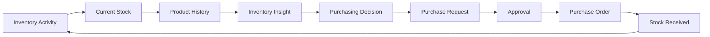
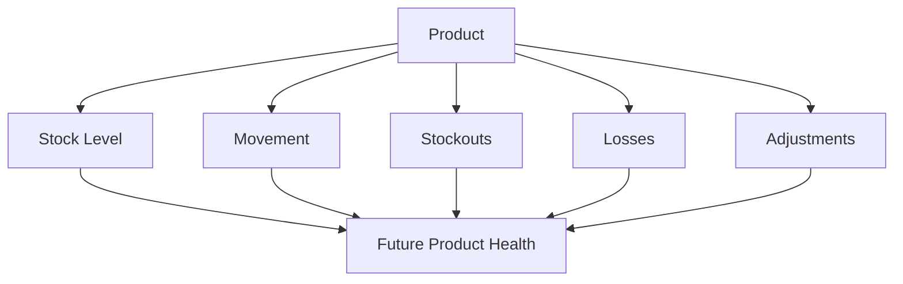
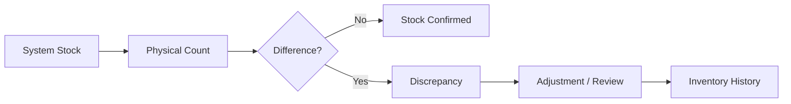
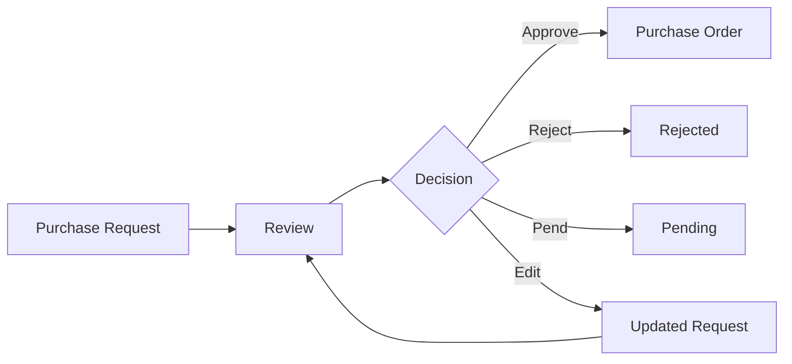
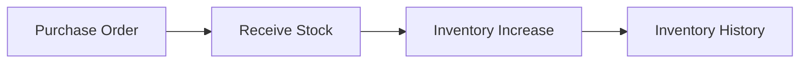
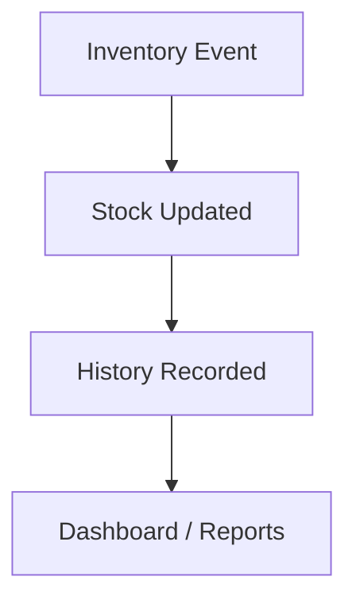
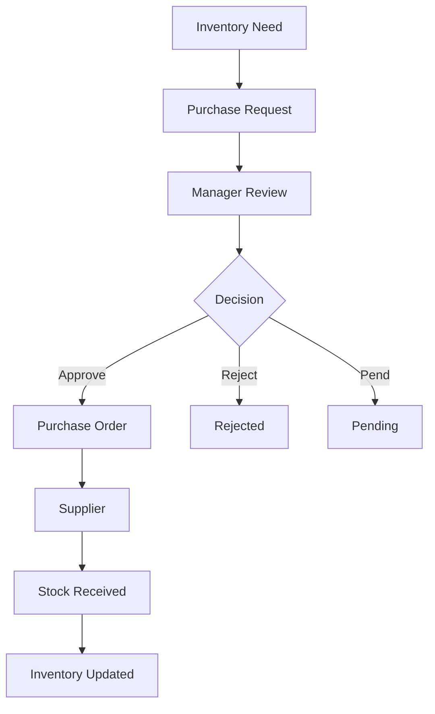
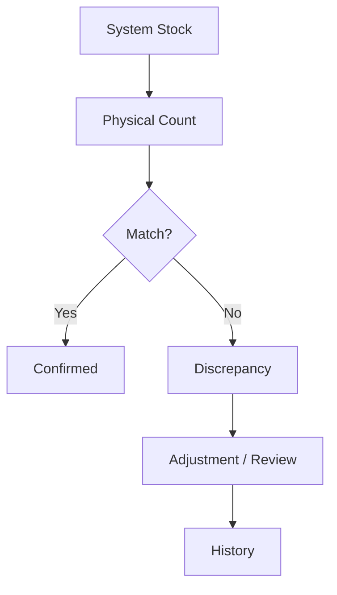
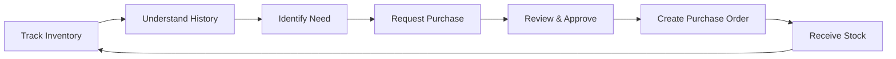

# SwiftBuy — Product Requirements Document (PRD)

## 1. Product Overview

**Product:** SwiftBuy  
**Version:** MVP / V1  
**Product Type:** Inventory & Procurement Management System  
**Target Users:** Small and medium-sized businesses (SMEs)

### Product Vision

SwiftBuy helps SMEs replace unreliable spreadsheet and paper-based inventory processes with a structured system for tracking inventory, understanding product movement, and making better purchasing decisions.

### Core Value Proposition

> **Know what you have. Understand what happened. Make better purchasing decisions.**

---

# 2. Problem Statement

Many SMEs still manage inventory using spreadsheets or paper records.

This often leads to:

- Inaccurate stock counts
- Duplicate data entry
- Lack of accountability
- Delayed procurement
- Inventory shortages
- Excess stock
- Poor reporting
- Difficulty understanding product movement

Businesses often make purchasing decisions based on assumptions because they cannot easily answer:

- How much stock do we currently have?
- How quickly is this product moving?
- What caused the stock to change?
- When was the last time we received this product?
- How often do we run out?
- What quantity should we consider purchasing?
- Why is the current stock different from the expected stock?

SwiftBuy aims to make these questions answerable from reliable historical inventory data.

---

# 3. Product Goal

The MVP should establish SwiftBuy as a **trusted source of inventory and purchasing information**.

The system should enable a business to:

1. Know its current stock.
2. Understand how stock changes over time.
3. Identify inventory problems.
4. Make purchasing decisions using available inventory information.
5. Control purchasing through an approval workflow.
6. Connect received stock back to inventory history.
7. Maintain accountability for important actions.

---

# 4. Core Product Loop

The core SwiftBuy workflow is:

## Core Principle

> **Current inventory should be explainable through its history.**

This principle drives the MVP requirements.

## 5. Target Users

### 5.1 Owner / Admin

#### Needs

- Business overview
- Inventory visibility
- Reports
- Inventory value
- Product performance/history
- Purchasing oversight
- Accountability

#### Primary Questions

- What inventory do we have?
- What has happened to our products over time?
- Which products require attention?
- What are we buying?
- Who approved or changed important records?

### 5.2 Inventory Manager

The Inventory Officer and Manager responsibilities are combined in V1.

#### Needs

- Current stock levels
- Product movement history
- Purchasing information
- Purchase requests
- Inventory insights
- Purchase decision support

#### Primary Questions

- What products are running low?
- How fast are products moving?
- What quantity may be needed?
- What has happened to this product historically?
- Which purchase requests should be approved?

### 5.3 Storekeeper

#### Needs

- Current stock at a glance
- Stock counting
- Stock receiving
- Stock discrepancy identification
- Inventory adjustments

#### Primary Questions

- How much stock should we have?
- How much stock do we physically have?
- What did we just receive?
- Is there a discrepancy?
- What needs to be reported to the Inventory Manager?

### 5.4 Supplier

#### Needs

- Supplier identification
- Purchase order information
- Delivery information

#### MVP Limitation

Suppliers are represented as business records.

A dedicated supplier portal is outside the MVP.

### 6. Product Health Concept

A product is considered "healthy" when it generally demonstrates:

- Availability
- Low or manageable stockout frequency
- Acceptable loss levels
- Stable or understandable movement
- Sufficient stock for expected demand

However, Product Health is currently a hypothesis.

The MVP should therefore capture the underlying data required to evaluate product health rather than build an advanced health-scoring system.

## 7. Product Requirements

### 7.1 Authentication & RBAC

#### Requirement

Users must authenticate before accessing SwiftBuy.

The system must enforce permissions based on user roles.

- Must Support:
- Authentication
- User roles
- Permission enforcement
- Business-level access control
- Action attribution

### 7.2 Product Management

#### Requirement

Authorized users must be able to manage the products tracked by the business.

Must Support:

- Create product
- Update product
- Category
- SKU
- Unit
- Product status

### 7.3 Inventory

#### Requirement

SwiftBuy must maintain the current stock quantity for each product.

Must Support:

- View current stock
- View stock by product
- Stock counting
- Stock adjustments
- Inventory-changing events
- Inventory history

#### Core Rule

Users should not silently overwrite stock quantities.

A quantity change must have an identifiable reason or event.

### 7.4 Inventory History

#### Requirement

SwiftBuy must maintain a historical record of inventory changes.

Each event should capture:

- Product
- Quantity change
- Event/reason
- Date/time
- User responsible
- Initial Hypothesized Events
- Stock received
- Sales / stock-out
- Damaged goods
- Stock count correction

These event types should be validated during real-world discovery.

### 7.5 Stock Counting

#### Requirement

The Storekeeper must be able to compare physical stock against system stock.

#### Workflow

### 7.6 Suppliers

#### Requirement

SwiftBuy must maintain supplier information for procurement.

Must Support

- Create supplier
- Update supplier
- Supplier details
- Associate supplier with purchase orders
- Supplier purchasing history

### 7.7 Purchase Requests

#### Requirement

Authorized users must be able to create purchase requests when inventory requires replenishment.

Request Should Include:

- Product
- Quantity
- Supplier where applicable
- Requesting user
- Reason/context
- Status

### 7.8 Purchase Approval

#### Requirement

Authorized managers must be able to review purchasing requests before they become purchase orders.

Must Support:

- Review
- Approve
- Reject
- Pend
- Edit where permitted

#### Approval Workflow

#### Decision Support

The reviewer should be able to see relevant inventory information/history before making a decision.

### 7.9 Purchase Orders

#### Requirement

Approved purchasing requests must be converted into trackable purchase orders.

Must Support:

- Supplier
- Products
- Quantities
- Order status
- Order dates
- Outstanding quantities

### 7.10 Receiving

#### Requirement

The Storekeeper must be able to record inventory received against a purchase order.

Must Support:

- View outstanding orders
- Record received quantity
- Partial delivery
- Full delivery
- Outstanding quantity
- Relationship

### 7.11 Dashboard

#### Requirement

The dashboard should provide actionable visibility into the current state of the business inventory.

Must Support Visibility Into:

- Current inventory
- Products requiring attention
- Recent inventory activity
- Pending purchase requests
- Outstanding purchase orders

#### Principle

> **Every dashboard metric should support a business decision.**

### 7.12 Reports

#### Requirement

Users must be able to retrieve historical information without manually reconstructing it from spreadsheets.

MVP Reports:

- Current inventory
- Product movement history
- Inventory adjustments
- Purchase history
- Purchase order status
- Inventory value where applicable

### 7.13 Audit Logs

#### Requirement

Important actions must be traceable.

Must Capture:

- Actor
- Action
- Target
- Timestamp
- Relevant context
- Important Events
- Inventory adjustments
- Stock receiving
- Purchase approval
- Purchase rejection
- Purchase changes
- Product changes
- User/permission changes where applicable

### 8. Core User Workflows

#### 8.1 Inventory Workflow

### 8.2 Procurement Workflow

### 8.3 Stock Verification Workflow

### 9. MVP Scope

Included

- Authentication
- RBAC
- Products
- Categories
- Inventory
- Inventory History
- Stock Counting
- Stock Adjustments
- Suppliers
- Purchase Requests
- Purchase Orders
- Purchase Approval
- Receiving
- Dashboard
- Reports
- Audit Logs

### 10. Explicitly Excluded

The following are outside the MVP:

- Payments
- POS
- Customer management
- Multi-store
- Multi-warehouse
- Barcode scanning
- AI forecasting
- Accounting
- Offline synchronization
- Supplier portal
- Advanced profitability analytics
- Reason

Solve inventory management and procurement control before expanding into ERP.

### 11. MVP Assumptions & Hypotheses

The following must be validated rather than treated as established facts:

Inventory Events

Initial hypotheses:

- Stock received
- Sales
- Damaged goods
- Stock count correction
- Product Health

Product health may depend on:

- Stock availability
- Product movement
- Stockouts
- Losses
- Adjustments

#### Demand Planning

Historical product movement may eventually help determine how much inventory is needed for a future period.

Automated forecasting is excluded from the MVP.

Market Conditions

Market conditions may influence purchasing decisions but are not an MVP dependency.

### 12. MVP Success Criteria

The MVP should demonstrate that users can:

#### Inventory

- Know current stock without relying on the old spreadsheet.
- Understand how stock changed.
- Investigate stock discrepancies.

#### Procurement

- Identify purchasing needs.
- Create purchase requests.
- Review purchasing decisions using inventory information.
- Approve, reject, or pend requests.
- Track purchase orders.

#### Receiving

- Record received stock.
- Connect received stock to the purchase order.
- Update inventory automatically.

#### Accountability

- Identify who performed important actions.
- Trace important inventory changes.
- Adoption

SwiftBuy should become the primary operational source of inventory information.

### 13. MVP Success Metrics

| Area                 | Metric                                               |
| -------------------- | ---------------------------------------------------- |
| Inventory Visibility | Time required to determine current stock             |
| Inventory Accuracy   | System vs physical stock variance                    |
| Traceability         | % of inventory changes with traceable events         |
| Procurement          | Time from purchase request to decision               |
| Adoption             | % of core inventory operations performed in SwiftBuy |
| Stock Availability   | Stockout frequency                                   |
| Accountability       | % of critical actions with identifiable actors       |
| Reporting            | Time required to retrieve product history            |

> **Baseline values should be collected before or during initial adoption. Do not invent targets without business data.**

### 14. MVP Decision Rule

Every proposed feature should answer at least one of these questions:

1. Does it help the business know its inventory?
2. Does it help the business understand inventory history?
3. Does it help the business identify inventory problems?
4. Does it help the business make purchasing decisions?
5. Does it help the business control purchasing?
6. Does it help the business maintain inventory accountability?

If not, defer it from the MVP.

### 15. MVP Definition of Done

SwiftBuy MVP is ready for real-world validation when a business can complete this loop without relying on its old spreadsheet as the primary source of truth:

The MVP is not the collection of features. The MVP is the successful completion of this business loop using trusted data.
